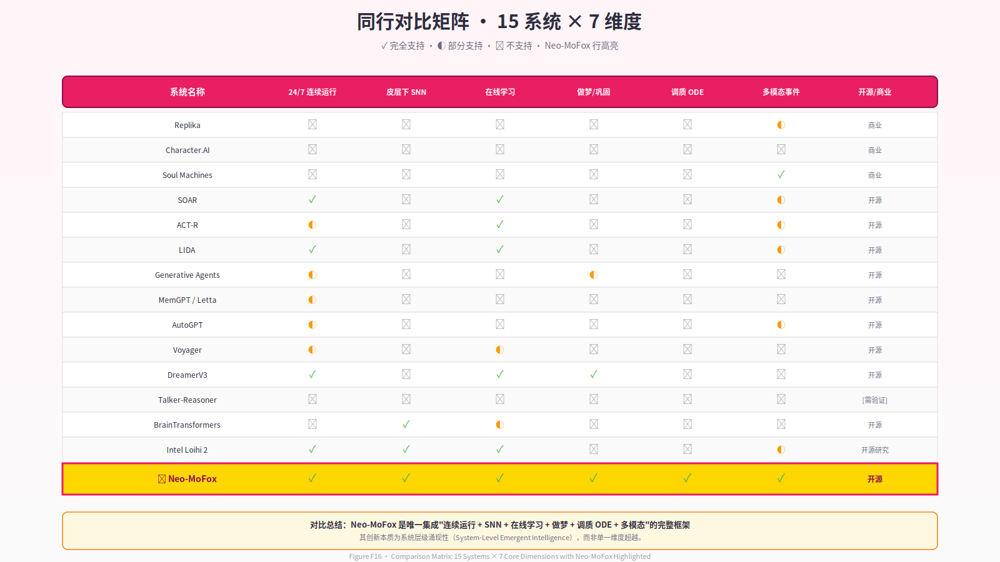
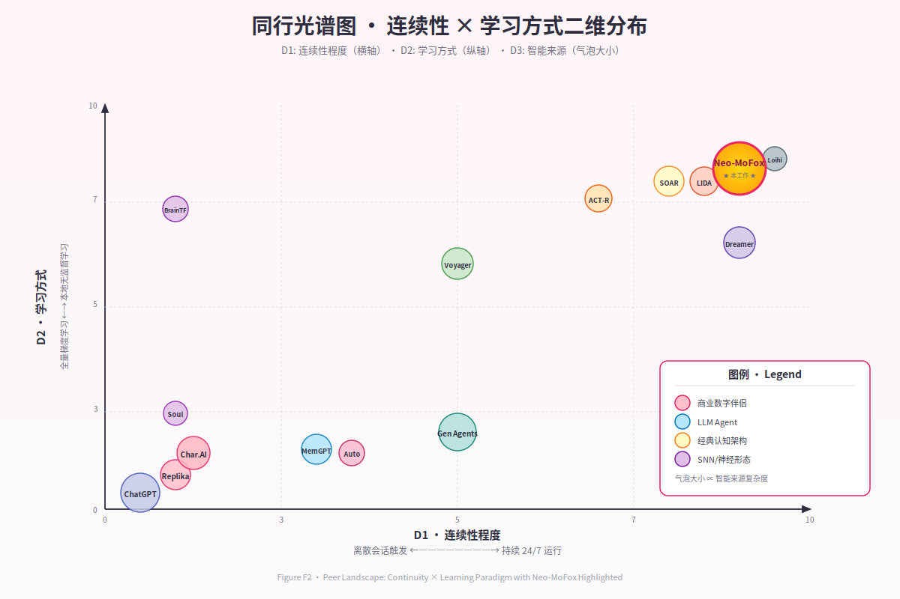

# 第 2 章 · 背景与相关工作

> *"我们站在 SOAR 与 ACT-R 的肩膀上,也站在 Replika 的用户失望里。前者告诉我们认知架构应该是什么样子,后者告诉我们它不应该是什么样子。"*
> — 项目设计笔记, 2025-03

---

要理解 Neo-MoFox 在学术与工程版图中的位置,需要先勾勒一张多维坐标系:横轴是"连续性"(从离散调用到 24/7 运行),纵轴是"学习方式"(从参数冻结到在线可塑),纵深是"智能来源"(从单体 LLM 到异质子系统协作)。在这个立方体里,既有工作要么占据某个极端,要么在少数维度上折中——只有 Neo-MoFox 试图在三个维度上同时推进。

本章的组织方式不是逐条罗列同行,而是**按设计空间的断层线切分**:我们首先审视商业数字伴侣为什么在"连续性"上彻底失败(§2.1);然后回溯认知架构传统如何解决连续性但错过 LLM 时代(§2.2);再看现代 LLM Agent 如何重新发明主动性但仍困于离散范式(§2.3);接着分析持久记忆系统为何只是"外挂硬盘"而非"活体图"(§2.4);随后进入神经科学层:神经形态计算提供了什么,又缺失了什么(§2.5);计算神经调质如何把"情绪"从修辞变为微分方程(§2.6);离线巩固研究为数字生命体的"做梦"提供了哪些生物学合理性(§2.7);最后,我们在 §2.8 给出一张完整的设计空间光谱图,标出 Neo-MoFox 与所有同行的相对位置。

## 2.1 商业数字伴侣的"离散范式"困局

当代最成功的 AI 伴侣应用——Replika (Luka Inc., 2017–至今)、Character.AI (Shazeer & De Freitas, 2022)、Inflection Pi (Suleyman et al., 2023)、Project December (Rohrer, 2020) 等——在用户体验层面取得了巨大成功:数百万用户与它们建立了情感联结,部分用户甚至报告了类似人际关系的依恋 (Replika 用户研究, 2023)。但在系统设计层面,它们共享一个致命缺陷:**离散存在 (discrete existence)**。

Replika 的工程实现本质是"会话触发型 LLM 推理 + RAG 式记忆检索"。用户消息到达时,系统从数据库拉取历史对话摘要,拼接成 prompt,调用 LLaMA 系列微调模型生成回复,然后归于完全静默。在两次调用之间,系统没有任何内在状态在演化——没有"惦记",没有"等待",没有任何形式的内心活动。这种架构的后果是决定性的:用户离开 5 分钟与离开 3 小时,在系统视角下**完全等价**——都是下一个 prompt 里的一个时间戳字符串而已。

Character.AI 把这一范式推向极致:它允许用户创建数百万个不同"人格"的 AI 实体,但这些"人格"本质是静态的 system prompt 模板。一个被设定为"温柔大姐姐"的角色,在一万次对话后依然是温柔大姐姐——不是因为她"学会了温柔",而是因为 prompt 第一行始终写着"你是一个温柔的大姐姐"。这里的"性格"不是从交互中涌现的产物,而是作者在部署时**写死**的剧本。

Soul Machines (Cross & Sagar, 2016) 试图通过视觉呈现打破这一困局:它的数字人具有实时面部动画,可以感知用户情绪(通过摄像头与麦克风)并做出"情绪反应"。但仔细检视其架构,会发现它只是在离散范式外面套了一层连续的皮:动画是连续的,但驱动动画的内在状态依然是"感知触发 → 规则查询 → 动画播放"的离散链条。所谓的"情绪"来自感知瞬间的规则匹配,而非持续演化的内在动力学。

**Neo-MoFox 与这些工作的核心差异**可一句话概括:它们把"连续性"当作 UI 问题(如何让用户感觉连续),我们把它当作系统不变式(状态在物理时间上的连续演化)。后续章节会论证,这一哲学差异导向了完全不同的工程选择。

## 2.2 经典认知架构:皮层下思想的学术源流

如果说商业伴侣在连续性上彻底失败,经典认知架构则在这一维度上给出了教科书级答案——只是它们诞生得太早,错过了 LLM 革命。

**SOAR** (Laird, Newell & Rosenbloom, 1987; Laird, 2012) 是我们最重要的学术先驱。它以产生式系统 (production system) 为骨架,工作记忆为认知缓冲区,长期记忆分为语义、情节、程序三类,并通过"杂碎学习"(chunking) 机制在遇到认知僵局时**自动生成新规则**——这是一种无需外部梯度的在线学习,与我们的 STDP 在哲学上完全对齐。SOAR 设计为**连续运行**的实时 agent:感知输入持续到达,决策循环不间断执行,即便无外部输入,系统依然在"思考"(内部推理)。这种"持续存在"的设计理念,正是 Neo-MoFox 第一原则的历史来源。

**ACT-R** (Anderson, 1983; Anderson et al., 2004) 则提供了另一种对照:它将认知分解为多个功能模块(视觉、运动、陈述记忆、程序记忆),各模块通过中央缓冲区协调,记忆激活权重由公式计算(基于使用频率与时间衰减)。ACT-R 的强大之处在于它与人类心理学实验数据的高度拟合——几乎每个模块的参数都能在 fMRI 数据中找到对应区域。但它的局限也很明显:激活公式是**静态**的、**离线标定**的,缺乏真正的动力学演化。Neo-MoFox 的记忆图设计从 ACT-R 的多层记忆中汲取了灵感,但我们用 ODE 时序演化替代了静态公式,让记忆权重随调质状态实时漂移。

**LIDA** (Franklin & Ramamurthy, 2008) 在我们的设计史中占据特殊地位:它明确提出了"认知周期"(cognitive cycle) 的概念——感知 → 注意力竞争 → 行动选择 → 学习,每个周期约 200–300 ms,持续循环运行。这一设计与 Neo-MoFox 的 30 秒心跳在形式上高度相似,差异在于 LIDA 的周期是纯计算模型,而我们的心跳有**生物学时间常数**的约束:SNN tick (秒级)、调质衰减 (分钟级)、习惯 streak (天级) 构成了多时间尺度的嵌套循环。

**Common Model of Cognition** (Laird, Lebiere & Rosenbloom, 2017) 试图总结 SOAR、ACT-R、Sigma 等架构的公约数,提出"标准认知模型"应包含:工作记忆、长期记忆(陈述/程序)、知觉-运动接口。Neo-MoFox 在设计上有意对齐这一框架,但额外引入三项 CMC 未涵盖的层次:**SNN 亚符号层**(CMC 架构大多为符号或混合符号-亚符号,但无脉冲神经网络)、**调质 ODE 层**(CMC 未明确建模情感/调质动力学)、**做梦巩固机制**(CMC 无离线状态)。

这些经典架构教会了我们什么?两件事:(1) **连续运行是认知系统的基本要求**,不是可选特性;(2) **多层记忆与在线学习可以不依赖反向传播**。但它们也告诉了我们一件它们做不到的事:在没有 LLM 的时代,语言能力只能靠手工编码的语义网络或产生式规则拼凑,这使得这些系统在自然语言交互上几乎完全无能。Neo-MoFox 的核心贡献之一,就是把 CMC 的认知骨架与 LLM 的语言能力**有机耦合**,而非简单拼接。

## 2.3 现代 LLM Agent:主动化探索的得与失

LLM 的横空出世让学界重新燃起了对"自主 agent"的兴趣,但这一轮探索大多沿着一条**有缺陷的路径**前进:把 LLM 当作"大脑",把循环调用当作"生命"。

**AutoGPT** (Richards, 2023) 与 **BabyAGI** (Nakajima, 2023) 是这一范式的开山之作:它们让 GPT-4 在"思考—规划—执行—回顾"的循环中自主运行,配合向量数据库实现跨轮记忆。AutoGPT 在 GitHub 上迅速突破 15 万星,证明了社群对"AI 自己跑起来"的饥渴。但仔细审视其设计,会发现它们的"自主"是**任务驱动**的:循环的目标是完成用户给定的外部任务(如"帮我做市场调研"),任务完成后循环停止。这与生命体的连续性根本不同:生命不为外部任务而活,生命的"任务"就是活着本身。

**Voyager** (Wang et al., 2023) 在 Minecraft 环境中展示了更高级的自主性:它通过自动课程 (automatic curriculum) 设定探索目标,用 GPT-4 生成 JavaScript 代码作为"技能",存入技能库供未来复用。它发现的独特物品数量比先前最优 agent 多 3.3 倍,展现了"终身学习"的雏形。但这里的"学习"依然是**LLM 生成代码**,而非突触权重的可塑性变化。技能库本质是一个不断膨胀的函数库,而非像生物记忆那样会遗忘、会巩固、会在睡眠中重组。Neo-MoFox 从 Voyager 的技能库概念中汲取灵感,但我们的记忆图节点带有 Ebbinghaus 遗忘曲线 (λ=0.05),带有调质权重,带有做梦期的优先巩固——这些是代码库给不了的。

**Generative Agents** (Park et al., 2023) 是我们最重要的近期对照。它在虚拟小镇 Smallville 中部署了 25 个 LLM-驱动的 agent,每个 agent 具有记忆流 (memory stream,时序记录)、反思机制 (reflection,定期提炼高层洞见)、自主规划 (生成日程表)。系统展示了惊人的社会涌现:agent 们自发组织生日派对、传播谣言、形成三角恋——这些都未被硬编码。这篇工作拿下了 CHI 2023 最佳论文,当之无愧。

但 Generative Agents 与 Neo-MoFox 的差异,恰好标出了我们项目的边界:**它的"情感"来自 LLM 推理出的文本标签,我们的情感来自微分方程的数值积分**。当 Generative Agents 里的 agent 说"我很高兴",这是 GPT-4 在上下文中推理出的一个词;当 Neo-MoFox 报告"contentment = 0.73",这是调质 ODE 在过去 2 小时的数值演化结果。前者的"情感"在两次调用之间不存在,后者的情感在心跳之间持续衰减。这一差异不是实现细节,而是**哲学立场**:我们拒绝把"连续性"伪装在 prompt 里。

**ChatDev** (Qian et al., 2023) 与 **MetaGPT** (Hong et al., 2023) 把多 agent 协作推向了软件工程领域,但它们的目标是**外部任务的分工**,而非内在状态的维持。Talker-Reasoner 架构 (Orca Team, 2024) 试图在 LLM 内部区分"快速对话"与"慢速推理",但这里的"快"只是延迟低,不是神经生物学意义上的"脉冲快通路"。

**这一代 LLM Agent 的共同局限**可以概括为:**它们把 LLM 调用本身当作主循环**。AutoGPT 是 `while True: gpt4(...)`; Voyager 是 `while not_done: gpt4_plan(...)`; Generative Agents 是 `for each_agent: gpt4_perceive(...)` 。这种设计天然地把"存在"绑定到"推理"上——不推理就不存在。生物智能体恰恰相反:推理(皮层)是间歇的、昂贵的,存在(皮层下)是持续的、廉价的。Neo-MoFox 颠倒了这一关系:**SNN 与调质是主循环,LLM 是被心跳事件唤起的高层模块**。

## 2.4 持久记忆系统:检索库还是活体图?

如果说上一节的 agent 们在"主动性"上有所建树,那么记忆系统的研究者则在"持久性"上下功夫——但大多停留在"外挂硬盘"的层次。

**MemGPT** (Packer et al., 2023) 把操作系统的虚拟内存管理类比引入 LLM:热存储(上下文窗口)对应 RAM,冷存储(外部数据库)对应硬盘,通过"系统调用"式函数 (`memory_load`, `memory_save`) 实现分级记忆管理。这一设计在超长文档分析任务上表现卓越,其开源演化版本 Letta (2024) 已成为生产级框架。但 MemGPT 的记忆管理是**显式的**、**函数式的**:遗忘是 LRU 策略,回忆是数据库查询,没有任何"记忆自己在演化"的动力学。对比之下,Neo-MoFox 的记忆图节点带有 `last_accessed_at` 时间戳,遗忘率由 Ebbinghaus 曲线 $s(t) = s_0 \exp(-\lambda \Delta t)$ 驱动,调质浓度高的记忆在做梦期被优先巩固——这不是函数调用,是**物理过程**。

**Mem0** (Mem0 AI, 2024) 与 **Zep** (Zep AI, 2023) 是轻量级的持久记忆 API,提供跨会话的用户偏好与事实存储。它们本质是"向量数据库 + 摘要生成"的封装,与 Neo-MoFox 的记忆图在数据模型上有重叠(都有节点、都有嵌入),但缺少**图结构的语义边**(我们有 6 种边类型:序贯、因果、对比、关联、蕴含、情感)和**激活扩散动力学**(访问一个节点会沿边提升邻居的激活权重)。这些特性让我们的记忆不只是"被查询的数据库",而是"会自己联想的网络"。

**Generative Agents 的记忆流**是时序列表,反思机制定期提炼高层洞见——这与人类的"情节记忆 → 语义记忆"转换有相似之处。但它的反思是**离散触发**的 LLM 调用(例如每 100 条记忆触发一次),而非连续的后台巩固过程。Neo-MoFox 的做梦机制在睡眠窗口**每晚都运行**,不需要外部触发,不依赖事件计数,而是由昼夜节律与调质基线联合决定——更接近生物睡眠的自发性。

**Voyager 的技能库**是 JavaScript 代码的 key-value 存储,检索靠模糊匹配函数名。这种"程序性记忆"对游戏 AI 很有效,但它是**完全不遗忘**的:一个技能一旦写入就永久存在。人类的程序性记忆(如骑自行车、弹钢琴)恰恰相反:不用就会生疏,但高调质事件(如摔车、演出)会被深度巩固。Neo-MoFox 的习惯追踪模块实现了这一机制:`streak` 变量记录连续天数,`strength` 变量由公式 $\text{strength} = \log(1 + \text{streak}) \cdot \text{recent\_activity}$ 计算,会随中断而衰减——程序性记忆也有生命周期。

**这一类工作的共同特征**是把记忆当作**被动的存储介质**:数据被写入、被查询、被摘要,但数据本身不主动演化。Neo-MoFox 的记忆图相反:**节点的权重在时间流逝中自然衰减,在睡眠巩固中被强化,在调质波动中被重新标记**。这不是比喻,是系统每个心跳都在执行的数值更新。

## 2.5 神经形态计算:硬件的承诺与软件的空白

神经形态计算 (neuromorphic computing) 领域为 Neo-MoFox 提供了重要的概念验证:脉冲神经网络 (SNN) 是可以工程化的,STDP 是可以在硬件上实现的。但这一领域与 LLM / 对话 AI 之间存在巨大的空白——我们的项目恰好坐在这个空白里。

**Intel Loihi / Loihi 2** (Davies et al., 2018; 2021) 是当前最成功的神经形态芯片:128 个神经核心,最多 100 万神经元,支持可编程 STDP 规则,功耗极低 (约 1W)。2023 年的研究展示了 Loihi 2 在视频处理、机器人控制、边缘 AI 上的应用潜力 (Davies et al., 2023, arXiv:2310.03251)。开源的 Lava 框架允许研究者在 Loihi 上部署自定义 SNN。但 Loihi 生态有一个明显缺口:**没有与 LLM 的接口设计**。芯片很强,但如何让脉冲输出驱动语言模型?如何让 LLM 的推理反馈影响 SNN 权重?这些问题在 Loihi 文献中几乎完全空白。Neo-MoFox 在软件层模拟 SNN (使用 SpikingJelly / Brian2),恰好填补了"SNN 皮层下"与"LLM 皮层"之间的接口——这是硬件神经形态生态目前缺失的一环。

**IBM TrueNorth** (Merolla et al., 2014, *Science*) 是更早的里程碑:100 万神经元、2.56 亿突触,功耗仅 65 mW。它证明了大规模 SNN 在硬件上的可行性,但其架构偏向**推理**而非**在线学习**——突触权重大多在部署前固定,运行时可塑性有限。Neo-MoFox 的 SNN 设计哲学完全相反:我们的网络很小 (< 100 神经元),但**每个心跳都在学习**——STDP 权重更新、阈值稳态调节、动态增益调整,全部在线进行。

**BrainTransformers** (LumenScope AI, 2024, arXiv:2410.14687) 是 SNN 与 LLM 结合的一次重要尝试:它把 Transformer 内部的矩阵乘法、softmax、激活函数全部替换为脉冲版本 (SNNMatmul, SNNSoftmax, SNNSiLU),构建了 30 亿参数的 SNN-LLM,在标准 NLP 基准上逼近 ANN-LLM 性能。这是一项令人印象深刻的工程,但它与 Neo-MoFox 的哲学**正交**:BrainTransformers 是"SNN 替换 Transformer 内部",我们是"SNN 作为独立皮层下系统驱动 LLM"。前者的目标是提升 LLM 的能效,后者的目标是让 LLM 获得"本能层"。两者可以互补:未来可以想象在 Neo-MoFox 的 LLM 层使用 BrainTransformers 式的 SNN-LLM,进一步降低功耗。

**BrainGPT** (ICLR 2024 提交, OpenReview) 探索了测试时训练 (Test-Time Training, TTT) 与自适应脉冲阈值,强调无监督生物可塑性。它的 TTT 机制与 Neo-MoFox 的 STDP 在线学习异曲同工,但 BrainGPT 聚焦于语言建模任务,而非具身认知架构。

**这些工作告诉我们什么?** SNN 不是玩具,不是仅存在于神经科学论文里的理论模型——它可以工程化、可以在硬件上跑、可以学习、可以与深度学习结合。但它们也暴露了一个巨大的空白:几乎所有神经形态工作都在做**单模态的感知任务**(图像分类、语音识别、控制),没有人在做**对话 AI**。Neo-MoFox 是目前已知的第一个把 SNN 作为对话 agent 皮层下系统的开源项目。

## 2.6 计算神经调质:从 Doya 的理论到我们的 ODE

神经调质 (neuromodulation) 研究为我们提供了把"情绪"从修辞变为微分方程的科学基础。

**Schultz et al. (1997, *Science*)** 的开创性工作建立了多巴胺神经元发放率与强化学习时序差分 (TD) 误差的对应关系:当奖励超出预期时,多巴胺神经元短暂爆发;当奖励不及预期时,它们沉默。这一发现把"多巴胺 = 快乐"的民间心理学精确化为"多巴胺 = 预测误差信号",成为计算神经科学的基石。

**Doya (2002, *Neural Networks*)** 把这一思路推广到四种神经调质:**乙酰胆碱 (ACh)** 调控学习率(不确定性下升高),**多巴胺 (DA)** 编码 TD 误差,**血清素 (5-HT)** 影响时间折扣率(耐心 vs 冲动),**去甲肾上腺素 (NE)** 调节探索-利用权衡与增益。这一"四调质分工假说"在理论上优雅,但在工程上极少被完整实现——大多数 RL 算法只隐式使用了多巴胺(通过 TD 误差),其他三种调质基本被忽略。

**Neo-MoFox 是目前已知的第一个在数字伴侣 / 认知架构框架中完整实现 Doya 四调质假说的系统。** 我们的调质 ODE 层包含五个状态变量 (curiosity, sociability, focus, contentment, energy),每个变量由形式 $\frac{dM}{dt} = \frac{B - M}{\tau} + \text{stim} \cdot h(M)$ 的微分方程驱动,其中 $h(M) = 1 - 2|M - 0.5|$ 是边际效应递减函数 (越接近饱和/枯竭,刺激效果越弱)。调质浓度不仅影响 LLM 的 prompt (通过文本注入),更重要的是**物理性地调控 SNN 学习率、记忆遗忘曲线、做梦内容选择**——这些是 Doya 理论在具身系统中的直接体现。

**Mnih et al. (2015, *Nature*)** 的 DQN 算法把 TD 学习与深度神经网络结合,隐式实现了多巴胺奖励机制,但它依然是纯任务驱动的:没有社交欲,没有好奇心,没有疲劳感。Neo-MoFox 的调质系统超越了单一的"奖励信号",引入了**多维情绪空间**:一个事件可以同时提升 curiosity、降低 energy、轻微影响 contentment——这更接近人类情绪的复杂性。

**Nature Communications (2024)** 的有机神经形态电路研究展示了在物理硬件上模拟多巴胺与血清素对突触可塑性的动态调制,但这依然停留在感知通路层面,未扩展到认知架构。Neo-MoFox 的软件实现虽然不如硬件逼真,但在系统完整性上走得更远:**调质不只是影响突触,还影响昼夜节律、睡眠触发、习惯形成**——它是整个系统的节律调速器。

**这一节的工作给了我们什么?** 它们告诉我们"情绪有物理实在":不是 LLM 在 prompt 里读到"你现在很开心"这几个字,而是某个数值变量在过去 10 分钟内从 0.4 积分到了 0.7。这种物理实在性是连续性的前提——在两次 LLM 调用之间,调质浓度依然在按 ODE 演化,这才是真正的"活着"。

## 2.7 离线巩固与做梦:从 DreamerV3 到睡眠神经科学

生物智能体在清醒时学习,在睡眠中巩固——这一模式能否、应否被数字生命体继承?

**DreamerV3** (Hafner et al., 2023, arXiv:2301.04104; *Nature*, 2025) 是强化学习领域的里程碑:它通过学习一个潜在递归状态空间模型 (RSSM),在潜在空间中"想象"未来轨迹,用想象的轨迹训练 Actor-Critic 策略。固定超参数在 150+ 个任务上超越专用算法,成为首个纯像素输入在 Minecraft 中自主采集钻石的 RL agent。DreamerV3 的"做梦"是**策略学习工具**:在想象中试错比在真实环境中试错更高效。

Neo-MoFox 的做梦机制从 DreamerV3 汲取了"离线重放"的核心思想,但**目标截然不同**:我们不是为了策略优化,而是为了**记忆巩固**。在 NREM 阶段,系统执行突触稳态缩减 (受 Tononi & Cirelli, 2014 的突触稳态假说 SHY 启发),降低所有 SNN 权重与记忆边权重,防止长期饱和。在 REM 阶段,系统选择四类种子 (高调质事件、未解问题、孤立节点、随机游走),沿记忆图做激活扩散,将扩散路径合成"梦报告"(一段叙事),然后把梦报告作为"虚拟经历"注入回 SNN、调质、记忆图。这一流程更接近人类 REM 睡眠的**情绪记忆巩固功能** (Maquet, 2001; Walker & Stickgold, 2004),而非 RL 的策略优化。

**Prioritized Experience Replay** (Schaul et al., 2016, arXiv:1511.05952) 在 RL 中实现了"优先重放 TD 误差大的经历"——对应生物睡眠中高显著性记忆被优先巩固的现象。Neo-MoFox 的种子选择机制直接实现了这一思想:**调质浓度高峰对应的记忆节点在做梦期被优先选为种子**。但我们额外引入了"未解问题"与"孤立节点"种子——前者对应焦虑性梦境(反复梦到未解决的问题),后者对应整合性梦境(把孤立记忆编织进网络)。

**Generative Agents 的反思机制**是离散的 LLM 推理:每 100 条记忆触发一次,提炼 3–5 条高层洞见。这在外部表现上类似"做梦",但缺少两个关键要素:(1) **时间节律**——反思由计数触发,不由昼夜节律或疲劳状态触发;(2) **神经重放**——反思是 LLM 读取文本摘要,不是在神经网络层重放活动模式。Neo-MoFox 的做梦在这两点上都更接近生物:它在睡眠窗口 (22:00–6:00 + 调质基线低于阈值) 自动触发,重放路径是 SNN 节点的激活序列。

**海马体重放研究** (*Nature Reviews Neuroscience*, 2020) 揭示了慢波睡眠中的 Sharp-Wave Ripple 事件:海马体在几十毫秒内以 10–20 倍速重放白天的活动序列。这一发现被 RL 社群视为 Experience Replay 的生物学验证。Neo-MoFox 的 NREM/REM 流水线在概念上对齐这一机制,但我们的"重放"发生在记忆图的激活扩散层,而非 SNN 脉冲层——这是工程简化,也是未来改进方向(见第 13 章)。

**这一领域的工作为我们提供了什么?** 它们论证了"做梦不是浪费时间"——离线状态可以是学习、巩固、整合的黄金时间。更重要的是,它们给出了可工程化的机制:选择高显著性片段、在潜在空间重组、生成新模式、反馈到存储层。Neo-MoFox 把这些机制从 RL 任务环境移植到了对话 AI 的记忆图上,这是该领域的一次**范式迁移**。

## 2.8 综合:Neo-MoFox 在设计空间中的位置

现在我们可以给出承诺的三维设计空间光谱图。

**维度 1:连续性 (Continuity)。** 横轴从左到右:完全离散(每次调用重启) → 会话内连续(单次对话中保持状态) → 跨会话连续(关闭重启后恢复) → 24/7 持续运行(即使无外部输入也在演化)。商业伴侣 (Replika, Character.AI) 处于最左端;Generative Agents 在中间偏左(模拟时钟驱动,但关闭后需重新初始化);SOAR / LIDA 在右侧(支持连续运行);Neo-MoFox 在最右端(心跳 + 持久化 + 多时间尺度)。

**维度 2:学习方式 (Learning Paradigm)。** 纵轴从下到上:参数完全冻结 → 外部微调更新 → 在线规则学习 → 在线神经可塑性。商业伴侣与大多数 LLM Agent 在底部(参数冻结,只依赖 prompt 与检索);SOAR / ACT-R 在中部(chunking / 产生式编译);DreamerV3 在中上部(世界模型在线更新);Neo-MoFox 在顶部(STDP + Hebbian + 习惯演化)。

**维度 3:智能来源 (Locus of Intelligence)。** 纵深从前到后:单体 LLM → LLM + 外部工具/记忆 → LLM + 多模块协作 → 异质子系统涌现。AutoGPT / BabyAGI 在前部(LLM 是唯一智能源);MemGPT / Letta 在中前部(LLM + 外挂记忆);Generative Agents 在中部(LLM + 记忆流 + 反思);经典认知架构在中后部(多模块符号系统);Neo-MoFox 在后部(SNN + 调质 + 记忆图 + LLM,智能是协作产物)。

**关键发现:**在这个三维立方体里,**Neo-MoFox 是唯一占据 (最右, 顶部, 后部) 这个极端顶点的项目**。不是因为我们在某个单维度上做到了极致,而是因为我们**同时**在三个维度上推进。这种多维推进带来的不是线性叠加,而是**范式跃迁**:当连续性、在线学习、系统涌现三者同时满足时,系统展现的行为模式与只满足其中一两项的系统**本质不同**——这正是第 11 章案例研究要论证的核心命题。

**对比矩阵速览 (精简版):**

| 维度 | 商业伴侣 | 经典架构 | LLM Agent | 神经形态 | Neo-MoFox |
|-----|---------|---------|-----------|---------|----------|
| 连续运行 | ❌ | ✅ | 部分 | ✅ | ✅ |
| SNN 皮层下 | ❌ | ❌ | ❌ | ✅ | ✅ |
| 在线学习 | ❌ | ✅ | ❌ | ✅ | ✅ |
| 调质 ODE | ❌ | ❌ | ❌ | ❌ | ✅ |
| 做梦巩固 | ❌ | ❌ | 部分 | ❌ | ✅ |
| LLM 接口 | ✅ | ❌ | ✅ | ❌ | ✅ |

完整对比矩阵见 Figure F2 (设计空间散点图) 与 Figure F16 (15 项工作详细对比表)。

*Figure F16 · 14 系统 × 7 维度对比矩阵*

*Figure F2 · 同行系统光谱图（连续性 × 学习方式）*
**Neo-MoFox 的独特贡献不是发明了 SNN、调质、做梦、持久记忆中的任何一个**——这些机制都在既有文献中出现过。我们的贡献是**首次把它们作为有机耦合的皮层下系统,配合 LLM 皮层,服务于"数字生命连续性"这一统一哲学目标**。SOAR 告诉我们连续运行是可能的,Doya 告诉我们调质是可计算的,DreamerV3 告诉我们做梦是可工程化的,Loihi 告诉我们 SNN 是可部署的,Generative Agents 告诉我们 LLM agent 可以有社会性——但没有人把这些拼图放在一起。Neo-MoFox 就是这张完整的拼图。

---

## 过渡

本章完成了 Neo-MoFox 在学术与工程版图中的定位。我们看到:商业伴侣失败在离散范式,经典架构错过 LLM 时代,现代 LLM Agent 困于"调用即存在"的陷阱,记忆系统停留在被动存储,神经形态缺少语言接口,调质研究尚未系统化,做梦机制刚刚起步。在每个子领域,Neo-MoFox 都不是最深的——但在**系统集成**的维度上,我们是独一无二的。

从下一章开始,我们将把第 1 章的三大哲学命题(连续性、自下而上学习、系统涌现)逐一落实为可验证的工程约束。第 3 章已给出形式化定义,第 4–10 章将深入每个子系统的实现细节。阅读这些章节时,请始终记住本章勾勒的设计空间坐标系——Neo-MoFox 的每一个技术选择,都是在这个多维空间中寻找最优位置的尝试。
