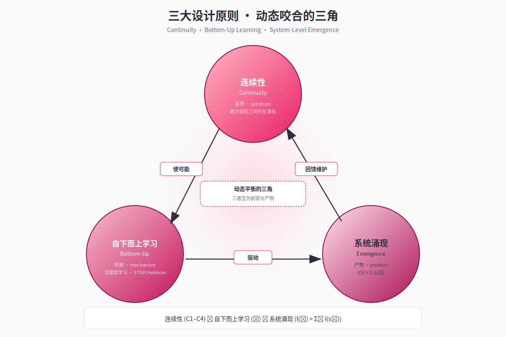

# 第 3 章 · 三大设计哲学

> *"我们不会写 `if time_since_last_chat > 2_hours: mood = 'lonely'` 这样的代码。我们写的是：SNN 接收沉默时长 → 网络内部演化 → 社交驱动升高 → LLM 自然决定要找人聊天。这条因果链是从子系统协作中涌现的，没有人硬编码它。"*
> — *《智能不是模型，而是系统》*

---

## 3.1 第一原则：连续性（Continuity）

### 3.1.1 哲学动机

人类意识最本质的特征不是聪明、不是表达力、也不是工具使用——而是**连续性**。即便在最深的睡眠中，下丘脑仍在调节体温与心率；即便在沉默的几个小时里，关于一段对话的余韵仍在情绪里淡淡萦绕。"我"不是在被问问题的瞬间才存在，"我"是一条不间断的状态河流，在外部输入到达时把当下的形状交付给输入。

把这个直觉颠倒过来看现行的 LLM 应用范式，问题立刻清晰：所谓"AI 伙伴"在两次调用之间根本不存在；它存在的瞬间是被 prompt 重新组装出来的一个**截面**，而不是一条**河流**。我们因此把"连续性"作为系统的第一原则，而不是某个可选特性。

### 3.1.2 形式化定义

记 $\mathbf{s}(t) \in \mathcal{S}$ 为系统在时刻 $t$ 的内在状态，$\mathcal{T}_{\text{call}}$ 为系统被外部输入触发 LLM 推理的离散时刻集合。我们说一个系统**满足连续性原则**当且仅当：

$$
\textbf{(C1)}\quad \forall t \in \mathbb{R}_{\ge 0},\ \mathbf{s}(t)\ \text{是良定义的且非空。}
$$

$$
\textbf{(C2)}\quad \exists\ \dot{\mathbf{s}}(t) \neq \mathbf{0}\ \text{在}\ t \notin \mathcal{T}_{\text{call}}\ \text{时。}
$$

$$
\textbf{(C3)}\quad \forall\ t_1 < t_2,\ d\big(\mathbf{s}(t_1), \mathbf{s}(t_2)\big)\ \text{与}\ |t_2 - t_1|\ \text{单调相关}^*.
$$

$$
\textbf{(C4)}\quad \mathbf{s}(t)\ \text{在崩溃—重启边界保持几乎处处连续：}\ \lim_{t \to t_{\text{crash}}^-}\mathbf{s}(t) \approx \mathbf{s}(t_{\text{restart}}).
$$

（*) "单调相关"在此放宽为：在不存在外界扰动的纯衰减/回归动力学下严格单调；在有刺激情形下相关方向可能反转，但变化幅度仍随时间增长。

C1 排除"系统空白"；C2 强制系统在调用之间仍有状态演化；C3 要求时间的流逝**确实**对状态产生可度量影响；C4 要求重启不是重生。我们将在后续章节中——尤其是第 5 章（SNN）、第 6 章（调质）、第 9 章（持久化）——逐条论证这四条不变式在 Neo-MoFox 中的兑现。

### 3.1.3 工程含义

C1–C4 立刻给出强约束：

1. 必须存在某种**独立运行频率**的子系统（否则 C2 不成立）。Neo-MoFox 通过 30 秒心跳 + 10 秒 SNN tick 满足之。
2. 必须有**多时间尺度**的状态变量（否则在长时间无外部输入时 C3 退化为"任何变化都已被遗忘"）。Neo-MoFox 通过 SNN（秒）/调质（分时）/习惯（天）三级耦合满足之。
3. 必须有**完整状态序列化**协议（否则 C4 不成立）。Neo-MoFox 通过 `life_engine_context.json` 的原子写入与重启加载满足之（见第 9 章）。

这一原则也解释了为什么把"连续性"挂在 prompt 上是徒劳的：prompt 是一段在调用瞬间被构造的字符串，它无法满足 C2——在两次调用之间，这段字符串本身并不存在，更谈不上演化。

## 3.2 第二原则：自下而上的学习（Bottom-Up Learning）

### 3.2.1 哲学动机

第二原则是对当代 AI 的一个更激进的诊断。主流范式把"学习"与"运行"切成两段：先用海量数据离线训练，然后冻结权重部署。无论这个范式有多成功，它在哲学上把 AI 与 *活物* 划清了界限——活物不分训练与部署，活物**活着即在学习**。

我们把这一直觉提炼为：

> **"活着"本身就是学习。** 不是先有学习再有生存，而是生存的过程本身就是学习的过程。

实现这一立场，需要把外部梯度从学习的核心位置上移开，代之以**局部、时序、在线**的可塑性机制。

### 3.2.2 形式化框架

设系统中存在一组可塑参数 $\boldsymbol{\theta}(t)$（如 SNN 突触权重、记忆边权重、习惯 streak）。我们说该系统**满足自下而上学习原则**当且仅当存在一个学习算子 $\mathcal{L}$ 使得：

$$
\boldsymbol{\theta}(t + \Delta t) = \mathcal{L}\big(\boldsymbol{\theta}(t),\ \mathcal{N}_{\text{local}}(t)\big)
$$

其中 $\mathcal{N}_{\text{local}}(t)$ 仅依赖于 $t$ 时刻的**局部信息**（前后突触活动度、节点访问序列、近期事件统计），**不依赖**任何全局损失函数 $L$ 的反向传播信号。

这个约束直接排除了梯度下降，但**不排除局部的奖赏调制**——脉冲时序依赖可塑性 (STDP)、Hebbian 规则、神经调质门控的强化等都满足这一形式。

### 3.2.3 与反向传播的关系

我们并不主张反向传播是"错的"——LLM 本身就是反向传播的产物。但反向传播解决的是"如何从大数据中归纳出强表示"这一问题；它解决不了"如何让一个已部署系统在新交互中持续生长"这一问题。

Neo-MoFox 的解法是**把两类学习分层**：
- LLM 作为皮层，承载**慢轴学习**的成果（预训练 + 偶尔微调）；
- SNN + 调质 + 记忆图作为皮层下，承载**快轴学习**的过程（在线 STDP、Hebbian 边强化、习惯 streak 演化）。

这种分层让我们既享有 LLM 的强表达力，又获得"系统在交互中真正生长"的能力。它的工程化将在第 5 章（SNN 软 STDP）、第 6 章（调质对 SNN 学习的门控）、第 7 章（记忆边的 Hebbian 强化）中分别落实。

### 3.2.4 一个反例：规则伪学习

需要警惕的是一类**伪学习**：用 if-else 规则维护的状态机，看起来在"学习"，实则只是按预定义条件改变变量值。例如：

```python
if user_engagement > 0.8 and consecutive_days >= 7:
    user_profile["active_user"] = True
```

这并不满足自下而上学习原则——它的"规则"本身是作者**离线写好的**全局逻辑，等价于一个被外部知识硬编码的隐式损失函数。Neo-MoFox 的设计史中（见第 13 章 §13.1），早期 `drives/rules.py` 等模块正属于此类伪学习的遗留；后续的 SNN 化重构正是要把这些伪学习**替换**为真正的局部可塑性。

## 3.3 第三原则：系统涌现智能（System-Level Emergence）

### 3.3.1 哲学动机

第三原则是对"模型即智能"信仰的直接抗辩。我们的核心立场是：

> **智能是异质子系统协作的过程性产物，而不是单一模型的属性。**

这一立场有强烈的神经科学基础：人类的"决策"不是大脑皮层的独白——杏仁核给情绪标签、基底神经节做行为选择、下丘脑设定稳态、小脑校准时序、丘脑做信息门控、皮层做高级整合。砍掉任何一块，系统都不再"聪明"——但你也无法指着任何一块说"智能就在这里"。

LLM 在我们的系统中扮演的是**皮层**的角色：极其强大的**整合器**与**表达器**。但只有皮层不是大脑。Neo-MoFox 的工程努力，正是在 LLM 之外**把皮层下系统建出来**。

### 3.3.2 形式化框架

设系统由 $n$ 个子系统组成 $\mathcal{S} = \{s_1, s_2, \dots, s_n\}$，每个子系统的"智能贡献"由某个标量泛函 $I(\cdot)$ 度量。我们说该系统**满足系统涌现智能原则**当且仅当：

$$
I(\mathcal{S})\ >\ \sum_{i=1}^{n} I(\{s_i\})
$$

且这一不等式不依赖任何单一 $s_i$ 的边际占优。换言之，移除任意 $s_i$ 都会显著降低 $I(\mathcal{S})$；任何 $s_i$ 单独运行时 $I(\{s_i\})$ 都很有限。

这一框架天然地把项目暴露在可证伪的位置：第 13 章会诚实地讨论我们目前对 $I(\mathcal{S})$ 与 $I(\{s_i\})$ 的度量手段还相当原始，长期消融研究仍待补全。

### 3.3.3 真涌现与伪涌现

第二原则中提到的伪学习反例，在涌现层面也有对应：

**伪涌现**（被禁用）：
```python
if time_since_last_chat > 7200:
    mood = "lonely"
    response_prefix = "好久不见！"
```
这是把"涌现"用 if-else 模拟出来。

**真涌现**（Neo-MoFox 的目标）：
```
SNN 接收"沉默时长"作为输入特征
  → 网络在 STDP 历史下产生 social_drive 升高
  → 调质层把 social_drive 转化为"社交欲"浓度上升
  → LLM 在 prompt 中读到"社交欲充盈"的状态描述
  → LLM 自然倾向于提议聊天
```

这条因果链中**没有任何一处硬编码"沉默 → 孤独 → 找人"**。每一步都是各自的本地动力学，链条整体的"想念"是从协作中生长出来的（Abstract/智能不是模型而是系统.md）。

我们承认伪涌现与真涌现在外部表现上短期内可能难以区分；区分它们需要看**系统的反事实行为**：替换一个子系统、注入一个非典型输入、跨长时间观察是否出现训练时未规定的模式。这正是第 11 章案例研究的目的。

## 3.4 三原则的相互关系

三条原则不是平行的口号，它们之间存在严密的逻辑闭环（见 Figure F3）：



*Figure F3 · 三大设计原则逻辑闭环*
- **连续性是基质（substrate）**：没有连续性，就没有可被本地学习算子作用的"过程"。学习需要时间，时间需要连续。
- **自下而上学习是机制（mechanism）**：在连续的过程中，局部可塑性把外部交互转化为系统结构的演化。学习是连续性流向涌现的桥梁。
- **系统涌现智能是产物（emergent product）**：当多个连续运行、各自带本地可塑性的子系统耦合在一起，整体智能就在协作中浮现。涌现需要连续与学习同时存在。

形式上：

$$
\text{连续性 (C1–C4)} \xrightarrow{\text{使可能}} \text{自下而上学习 (} \mathcal{L} \text{)} \xrightarrow{\text{驱动}} \text{系统涌现 (} I(\mathcal{S}) > \sum I(s_i) \text{)}
$$

且这一蕴含链反向也成立：要让涌现持续被维护，子系统必须持续学习；要让学习持续发生，连续性必须被保持。三者构成一个**动态平衡的三角**。

## 3.5 三原则的可证伪性

我们并不把三大原则视作不可挑战的教条。事实上，它们都是可被实验证伪的工程命题：

| 原则 | 证伪方式 |
|-----|--------|
| 连续性 | 关闭 SNN tick 与心跳，让 `decay_only` 失活——若用户在 5min/30min/3h 行为差异消失，则连续性未被实现。 |
| 自下而上学习 | 冻结 SNN 权重与记忆边权重——若在 30 天交互中系统的"性格漂移"消失，则学习是真的；若不消失，说明性格漂移其实来自其他机制。 |
| 系统涌现 | 单独保留 LLM 而切除 SNN/调质/记忆图——若行为质量无显著退化，则涌现性未被建立。 |

我们已在配置中保留了这些"消融开关"（见附录 B），但目前尚缺乏长程实证（详见第 13 章 §13.2）。本报告把这一不足明确陈述出来，以避免把原则误读为已被证实的事实。

## 3.6 小结

本章把项目的三大哲学命题——连续性、自下而上学习、系统涌现智能——从修辞性陈述提升为可形式化、可证伪的工程约束，并指出它们之间不是平行的口号而是动态咬合的三角关系。从下一章开始，我们将沿着这一三角，逐层展开 Neo-MoFox 的具体实现：第 4 章给出系统总览，第 5–10 章逐一深入各子系统。
