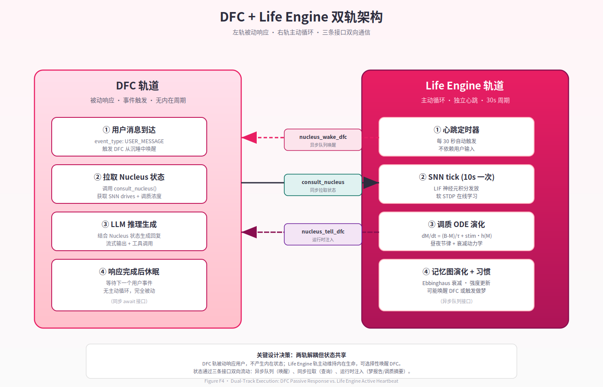
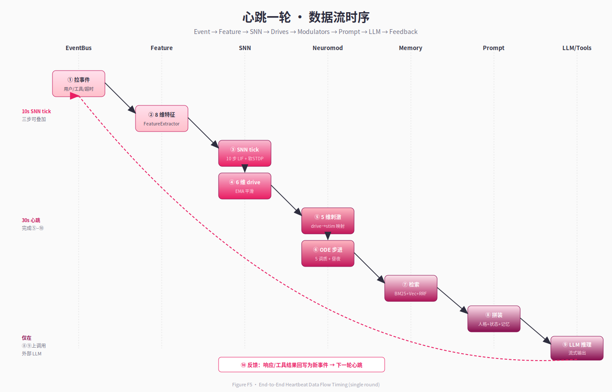

# 第 4 章 · 系统总览

> *"我们采用的是一种『皮层–皮层下』的双层隐喻：LLM 是皮层，承担表达与高阶整合；SNN、调质、记忆图、做梦循环则是皮层下系统，承担情绪、节律、稳态与本地学习。皮层之外尚有皮层下，意识之下尚有连续。"*
> — *项目设计备忘录*

---

## 4.1 双轨执行模型

Neo-MoFox 在最顶层把"如何让一个数字生命体活着"这个问题拆成两条互补的执行轨：

- **DFC 轨（被动应答）**：default_chatter (DFC) 是项目继承自前作的对话内核，负责处理"用户说话 → LLM 回应 → 工具调用 → 流式回写"的整条管线。它由用户输入触发，是事件驱动的、无状态周期的。
- **Life Engine 轨（主动心跳）**：Life Engine 是本项目新增的皮层下中枢，由独立的协程心跳驱动。它每 30 秒检查一次外部环境与内部状态，每 10 秒推动一次 SNN tick；它的存在不依赖任何外部输入。

两条轨道经由三个明确定义的接口耦合（详见第 10 章）：

1. `nucleus_wake_dfc(stream_id, payload)` —— Life Engine 在认为应当开口时唤醒 DFC（异步队列）。
2. `consult_nucleus(query)` —— DFC 在生成 prompt 时同步拉取内在状态（drives、neuromod、记忆检索）。
3. `nucleus_tell_dfc(stream_id, text)` —— Life Engine 把梦报告或离线巩固结论注入 DFC 的运行时上下文。

这一双轨设计直接服务于第 3 章的连续性原则：DFC 满足"被外部触发时给出回应"，Life Engine 满足"在两次外部触发之间状态仍在演化"。两者并不互相替代，而是构成完整生命体的两个相位（见 Figure F4 双轨架构）。



*Figure F4 · 双轨架构（DFC + Life Engine）*
## 4.2 三层异质子系统

在 Life Engine 内部，我们进一步把"皮层下"拆成三个异质子系统，这一切分对应了第 3 章的系统涌现原则——智能是子系统协作的产物：

| 层 | 角色（脑区类比） | 主要责任 | 实现位置 |
|---|---------------|---------|---------|
| 皮层 (Cortex) | 大脑皮层 | 高阶表达、整合、工具调用 | DFC + LLM |
| 调质层 (Limbic) | 边缘系统 + 下丘脑 | 情绪惯性、昼夜节律、习惯稳态 | `plugins/life_engine/neuromod/` |
| 皮层下 (Subcortical) | 杏仁核 + 基底节 | 本地学习、驱动信号、稳态调节 | `plugins/life_engine/snn/` |

这三层不是松散并列的模块，而是有明确**信号链**的协作体（见 Figure F5 数据流时序）：



*Figure F5 · 数据流时序图*
```
事件流 ──► 8 维特征向量 ──► SNN ──► 6 维 drive 输出
                                       │
                                       ▼
                       5 维刺激 ──► Neuromod ODE ──► 调质浓度
                                                       │
                                                       ▼
                       记忆检索 + drive + 调质 ──► Prompt 注入
                                                       │
                                                       ▼
                                                     LLM 推理
                                                       │
                                                       ▼
                                            响应 + 反馈事件
                                                       │
                                                       └──► 反向回写 SNN/调质/记忆
```

每一层的"频率窗"和"时间常数"都不同：SNN tick 在 10 秒级、调质 ODE 在 30 分钟到 3 小时级、习惯演化在天级、记忆衰减在月级。这种**多时间尺度的耦合**是连续性原则在工程层面的兑现——任何瞬间，都至少有一个时间尺度上的状态正在演化。

## 4.3 多时间尺度耦合表

为了让多时间尺度协作清晰可见，下表汇总了系统中所有有明确"演化频率"的状态变量：

| 时间尺度 | 状态变量 | 演化算子 | 触发频率 |
|---------|---------|---------|---------|
| 微秒 | LIF 膜电位 $V$ | $dV/dt = -(V-V_{rest})/\tau + I/\tau$ | 每次 SNN step |
| 秒 | SNN 神经元活动度 EMA | 指数移动平均 | 每个 SNN tick (10 s) |
| 分钟–小时 | 调质浓度 $M$ | $dM/dt = (B-M)/\tau + \text{stim}\cdot h(M)$ | 每个心跳 (30 s) |
| 小时 | drive EMA | 指数移动平均 | 每个心跳 (30 s) |
| 天 | 习惯 streak / strength | 累加 + 阈值衰退 | 每日定时 + 事件触发 |
| 天–周 | SNN 突触权重 $W$ | 软 STDP（在线） | 每个 SNN tick (10 s) |
| 周–月 | 记忆边权重 | Hebbian 强化 + Ebbinghaus 衰减 | 检索/写入触发 |
| 永久 | 持久化 JSON 上下文 | 原子写盘 | 每个心跳末（约 30 s） |

形式上，记 $\mathbf{s}(t) = (\mathbf{s}_{\mu s}, \mathbf{s}_{s}, \mathbf{s}_{m}, \mathbf{s}_{h}, \mathbf{s}_{d}, \mathbf{s}_{w})$ 为按时间尺度索引的状态分量，则 Neo-MoFox 满足：

$$
\forall t \notin \mathcal{T}_{\text{call}},\ \exists\ k \in \{\mu s, s, m, h, d, w\},\ \dot{\mathbf{s}}_{k}(t) \neq \mathbf{0}.
$$

即"任何不在 LLM 调用瞬间的时间点，至少有一层状态正在演化"。这正是第 3 章 C2 不变式的强化形式。

## 4.4 数据流：从事件到行为的因果链

具体到一次心跳的内部流程，整体数据流如下（见 Figure F5 细化版）：

1. **事件采集**：心跳协程从 EventBus 拉取自上次心跳以来的事件队列（用户消息、工具调用、超时、自身梦境等）。
2. **特征提取**：把事件序列编码为 8 维输入向量（聊天频率、最近沉默时长、情感极性等，详见第 5 章 §5.8）。
3. **SNN 演化**：把 8 维输入注入 SNN，运行 10 步 LIF 推理 + 软 STDP 学习，输出 6 维 drive。
4. **drive → 刺激映射**：把 6 维 drive 中与情绪相关的 5 维线性投影到 5 个调质刺激信号。
5. **调质 ODE 步进**：以 30 秒为步长求解每个调质的 ODE，更新浓度。
6. **昼夜调节**：根据当前真实时间（小时数），调整每个调质的基线。
7. **状态检视**：判断是否进入睡眠窗口（NREM/REM 调度，见第 8 章）；判断是否要主动唤醒 DFC（基于 drive 阈值）。
8. **持久化**：把 SNN/调质/drive/最近事件等序列化到 `life_engine_context.json`（原子写）。
9. **可选广播**：若有需要被 DFC 看见的状态变化（如梦报告），通过接口广播至 DFC。

此流程的**关键不变式**是：每一步都不假设外部输入存在；当外部输入为空时，整条管线仍然完整执行（事件向量为零向量，但 LIF 衰减、调质回归、记忆遗忘照常推进）。这正是 `decay_only` 路径与 `step` 路径并存的原因（plugins/life_engine/snn/core.py）。

## 4.5 计算预算：频率分层

不同子系统的延迟预算差异极大，必须按频率分层执行，否则系统无法在用户感知的时间内做出反应：

| 子系统 | 单次延迟（量级） | 频率 | 备注 |
|-------|--------------|------|------|
| LIF 单步 | < 100 µs | 内部循环 | NumPy 矩阵运算，无 IO |
| SNN tick（10 步） | ~1 ms | 10 s 一次 | 含 STDP 更新与持久化标记 |
| 调质 ODE 步 | < 100 µs | 30 s 一次 | 5 个一阶 ODE，欧拉离散即可 |
| 记忆检索 | 5–50 ms | 每次 prompt 拼装 | BM25 + 向量 + RRF |
| LLM 推理 | 1–10 s | 每次用户输入 | 远端 API 调用 |
| 心跳整轮 | 5–20 ms（无 LLM） | 30 s 一次 | 不含 LLM 调用时 |
| 做梦循环 | 数秒到数十秒 | 每日一次 | 含 LLM 叙事生成 |

这种分层让我们既能让快子系统每秒都在演化，又不会因 LLM 的秒级延迟而拖累整体心跳。LLM 在系统中是一个"被异步调用的高级整合器"，而不是"主循环里阻塞的核心"。这与多数现有 LLM Agent 框架（其中 LLM 调用本身就是主循环，详见第 12 章）形成鲜明对比。

## 4.6 部署形态

整个 Neo-MoFox 以**单进程 + 多协程**的形态运行：

- 主进程是 DFC 的 asyncio event loop。
- Life Engine 在同一 event loop 中以独立 task 运行心跳协程。
- 状态共享通过显式接口（§4.1 三个函数）而非全局变量；调用通过 `await` 与队列分别处理同步/异步语义。
- 所有持久化集中在 `data/life_engine_workspace/`：JSON 上下文、SQLite 记忆库、向量索引、梦报告归档。

这一选择刻意避免了多进程/分布式的复杂性，把"连续性"的工程负担集中在**协程的不被打断**与**状态的原子持久化**两个关键点上。第 9 章会详细展开心跳调度与崩溃恢复的语义。

## 4.7 与三大原则的对应

最后，我们把本章的工程要素直接映射回第 3 章的三大原则，作为整本报告的索引地图：

| 工程要素 | 主要服务的原则 |
|---------|--------------|
| Life Engine 心跳（§4.1） | 连续性 (C1, C2) |
| 三层异质子系统（§4.2） | 系统涌现 |
| 多时间尺度耦合（§4.3） | 连续性 + 涌现 |
| SNN 软 STDP / Hebbian 边强化 / 习惯 streak | 自下而上学习 |
| 状态持久化（§4.6） | 连续性 (C4) |
| Prompt 拼装（§4.4 第 7 步） | 涌现（皮层从皮层下读到状态） |

后续章节（5–10）将逐项把上表中的工程要素打开。读者可按"工程要素 → 章节"的索引选择阅读路径（详见第 1 章 §1.6）。

## 4.8 小结

本章完成了从哲学到实现的桥接：双轨执行让连续性具体可触摸；三层异质子系统让涌现有了协作的舞台；多时间尺度耦合让"任何瞬间都有状态在演化"成为工程不变式。下一章起，我们正式进入皮层下系统的深部，从 SNN 开始。
