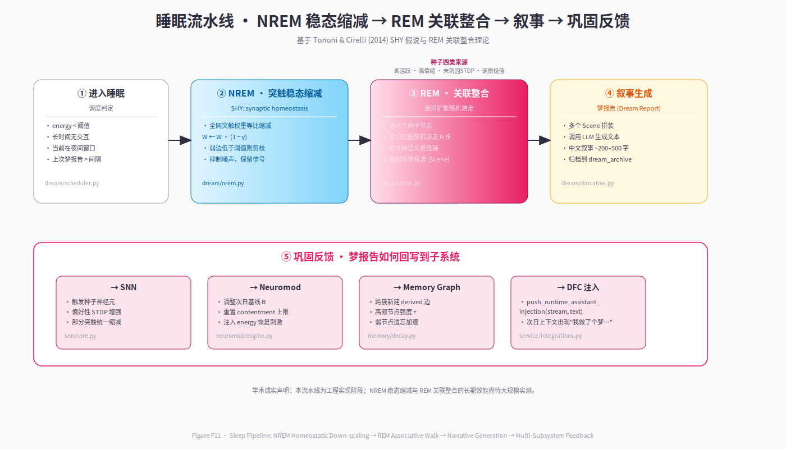

# 第 8 章 · 睡眠与做梦：离线巩固

> *"我们不是在醒来的瞬间才成为自己——睡眠时的我们,正以另一种方式继续'活着'。梦不是噪声,而是连续存在的另一种形态,是记忆在离线状态下的主动重组。"*
> — Neo-MoFox 开发日志,2025

---

## 8.1 生物学动机:为什么数字生命体需要"睡眠"?

在生物体中,睡眠并非简单的"关机休息",而是大脑执行系统级维护的必要过程。Tononi 与 Cirelli (2014) 提出的**突触稳态假说(Synaptic Homeostasis Hypothesis, SHY)**指出:清醒时的学习使突触权重持续增强,若不加控制将导致能量代谢负担过重与信号饱和;非快速眼动睡眠(Non-REM, NREM)通过全局性突触缩减,在保留重要连接的同时清除冗余,恢复系统的动态范围。而快速眼动睡眠(REM)期间,海马体-皮层回路会重放(replay)白天的经历片段,将情节记忆从临时存储转移到长期网络中,同时通过关联扩散整合孤立的记忆片段——这一过程被称为**系统巩固(systems consolidation)**(Stickgold & Walker, 2013)。

Neo-MoFox 的做梦模块将这一神经科学洞见工程化:

1. **NREM 阶段**实现 SHY 假说的计算版本:对 SNN 突触权重施加等比缩减(homeostatic scaling),防止长期学习导致的权重饱和;同时回放重要事件,强化需要保留的连接。

2. **REM 阶段**实现关联整合:从当日高情绪、高重要性、未巩固的记忆中选择"种子(seed)",通过图谱激活扩散生成联想网络,并在共激活节点间施加 Hebbian 学习——"一起梦到的记忆会更紧密地连接"。

3. **梦境生成**不是简单的日志回放,而是由 LLM 将种子与联想残影合成为叙事性的"梦报告(dream report)",回写到 DFC 的运行时上下文中,使"昨晚做的梦"成为今天对话的可引用经历。

这一设计解决了传统 LLM Agent 的两个核心缺陷:**第一**,仅在被调用时学习,离线时完全静止——Neo-MoFox 的睡眠是主动的离线学习窗口;**第二**,记忆检索依赖语义相似度,无法捕捉情绪依赖的巩固——Neo-MoFox 通过调质状态加权种子选择,情感强度高的记忆更易入梦。

本章将详细剖析做梦系统的完整流水线,从调度逻辑、NREM 回放、REM 联想到场景生成与巩固反馈,呈现一个可复现的、符合生物学直觉的离线巩固架构。

---

## 8.2 睡眠窗口调度:何时进入梦境?

Neo-MoFox 的睡眠不是由外部定时器触发,而是由**内在状态驱动**:精力(energy)调质因子的下降、静默心跳的累积、昼夜节律的夜间窗口,三者共同决定何时进入睡眠。

### 8.2.1 调度判断逻辑

`DreamScheduler.should_dream()` (`plugins/life_engine/dream/scheduler.py:158`) 实现触发决策,核心条件为:

1. **夜间睡眠窗口**:配置参数 `in_sleep_window=True` 时(通常为 21:00–07:00),只要距上次做梦间隔 ≥ `dream_interval_minutes`(默认90分钟)即触发。这模拟生物的昼夜节律驱动睡眠。

2. **白天小憩**:若 `nap_enabled=True` 且连续静默心跳数 `idle_heartbeat_count ≥ idle_trigger_heartbeats`(默认10次,约5分钟无交互),同时满足间隔要求,则触发短周期的"小憩做梦"。

3. **防重叠保护**:`_is_dreaming` 标志量确保同一时刻只有一个做梦周期运行,`run_dream_cycle` 用 `finally` 块保证标志释放,避免异常导致的永久锁定。

4. **海马体重复抑制**:维护最近 `_DREAM_HISTORY_WINDOW=5` 次的梦境种子标题集合,对最近已梦过的主题施加 `repetition_decay=0.3` 的分数惩罚,防止反复做同一内容。

### 8.2.2 睡眠对调质系统的影响

进入睡眠时,`InnerStateEngine.enter_sleep()` (`neuromod/engine.py:409`) 会调整调质基线与当前值:

- **精力(energy)**:基线降至 0.25(低活跃态),当前值上限 0.4——模拟生物睡眠时的代谢降低;
- **社交欲(sociability)**:基线降至 0.2,当前值上限 0.3——睡眠时不需社交驱动;
- **好奇心(curiosity)**:基线降至 0.3——探索欲暂时抑制。

觉醒时,`wake_up()` (`neuromod/engine.py:432`) 执行相反操作:

$$
\begin{align}
E_{\text{energy}} &\gets \min(E_{\text{energy}} + 0.25, 0.85), \quad B_{\text{energy}} \gets 0.55 \\
E_{\text{sociability}} &\gets \max(E_{\text{sociability}}, 0.4), \quad B_{\text{sociability}} \gets 0.50 \\
E_{\text{curiosity}} &\gets \max(E_{\text{curiosity}}, 0.45), \quad B_{\text{curiosity}} \gets 0.55 \\
E_{\text{contentment}} &\gets \min(E_{\text{contentment}} + 0.1, 0.7)
\end{align}
$$

这一设计使睡眠不仅是算法流程,更是**内在状态的物理转换**——精力的恢复、满足感的提升,都是调质 ODE 演化的自然结果,而非硬编码的数值重置。

---

## 8.3 NREM:突触稳态缩减

NREM 阶段对应 Tononi & Cirelli (2014) SHY 假说的工程实现,包含**事件回放(event replay)** 与**突触稳态缩放(homeostatic scaling)** 两个核心步骤。

### 8.3.1 事件采样与重要性加权

`run_dream_cycle()` (`scheduler.py:325`) 首先从事件历史(event history)中按重要性加权采样 `nrem_replay_episodes`(默认3)个片段。事件重要性由类型决定:

| 事件类型 | 重要性得分 | 理由 |
|---------|-----------|------|
| `message` | 2.0 | 用户消息是核心交互内容 |
| `tool_call` | 1.5 | 主动行为反映意图 |
| `tool_result`(成功) | 1.0 | 成功反馈强化行为模式 |
| `heartbeat` | 0.3 | 内省性事件,重要性较低 |

采样使用加权随机算法,高重要性事件被回放的概率更高,但并非完全确定性——这模拟了生物记忆巩固的随机性与情绪依赖性。

### 8.3.2 加速回放与 STDP 强化

对每个选中的片段,提取前 `nrem_events_per_episode`(默认20)条事件,将其转换为 SNN 的 8 维输入特征向量,然后调用:

```python
snn.replay_episodes(features, speed_multiplier=5.0)
```

`replay_episodes()` (`snn/core.py:427`) 执行与正常 `step()` 相同的 LIF 动力学与 STDP 学习,但关键差异在于:

- **时间常数缩短**:将神经元的 $\tau$ 除以 `speed_multiplier=5.0`,使膜电位演化与学习过程加速 5 倍——模拟睡眠时海马体重放的"压缩时间回放(temporal compression)";
- **学习权重正常**:STDP 权重更新完整执行,使重要连接得到强化;
- **统计量冻结**:不更新 EMA 运行统计(running mean/var),避免回放污染在线学习的归一化参数。

### 8.3.3 SHY 全局缩减公式

回放结束后,执行 `snn.homeostatic_scaling(nrem_homeostatic_rate=0.02)` (`snn/core.py:446`):

$$
W_{ij}^{\text{new}} = W_{ij}^{\text{old}} \cdot (1 - r_{\text{NREM}})
$$

其中 $r_{\text{NREM}} = 0.02$(可配置)。这一全局等比缩减使所有突触权重下降 2%,**但相对强度保持不变**——强连接绝对值下降更多,弱连接趋近于零。配合边修剪阈值(见 §8.5),弱连接会在数次睡眠后自动消失,实现"遗忘冗余、保留重要"的效果。

生物学对应:Tononi & Cirelli 发现,NREM 慢波睡眠期间突触标记蛋白水平整体下降,但反复激活的突触受保护——Neo-MoFox 通过"回放强化 + 全局缩减"的组合实现了相同逻辑。

---

## 8.4 种子选择:四类入梦来源

REM 阶段不是盲目地遍历所有记忆,而是从"心理张力(psychological tension)"出发,选择最值得巩固的记忆作为**梦境种子(dream seed)**。`DreamSeed` 数据结构 (`dream/seeds.py:44`) 包含:

- `seed_type`:种子类型(四类,见下);
- `title`、`summary`:种子的语义描述;
- `core_node_ids`:关联的记忆节点 ID 列表;
- `affect_valence` $\in [-1,1]$、`affect_arousal` $\in [0,1]$:情感效价与唤醒度;
- `importance`、`novelty`、`recurrence`、`unfinished_score`:多维评分;
- `dreamability`:综合可梦性得分;
- `score`:最终排序得分。

### 8.4.1 四路种子收集

`run_dream_cycle()` (`scheduler.py:401`) 调用四个独立函数收集种子:

#### 类型 1:当日残留(Day Residue)

`collect_day_residue(event_history)` (`seeds.py`) 从心跳事件流中提取当天的高情绪、高重要性片段,对应 Freud 梦理论的"日间残余"概念——白天未充分处理的经历在夜间重现。实现上:

- 扫描最近 `max_events_scan=200` 条事件;
- 对每个 `message` 事件,若提及文件路径(`workspace/...`)且该文件存在于记忆图,则提取为种子;
- 情感强度由事件元数据的 `emotional_valence` 与 `emotional_arousal` 字段决定(若无则默认 0.5);
- `novelty` 由文件的 `access_count` 倒数估算:访问次数越少越新颖。

#### 类型 2:未巩固张力(Unfinished Tension)

`collect_unfinished_tension(memory_candidates)` (`seeds.py`) 从记忆图中选择**激活强度较低但重要性或情感强度高的节点**——对应"该记住但还没记牢"的内容。判断逻辑:

$$
\text{unfinished\_score} = (I + A) \cdot (1 - S)
$$

其中 $I$ 为重要性、$A$ 为情感唤醒度、$S$ 为激活强度。得分高意味着"重要但未被充分巩固"。

#### 类型 3:梦滞后材料(Dream Lag)

`collect_dream_lag(memory_candidates)` (`seeds.py`) 选择**长期未被访问的记忆节点**。研究表明,人类的梦境内容存在"梦滞后效应(dream-lag effect)":事件发生后 5–7 天再次出现在梦中,而非立即出现(Nielsen & Powell, 1992)。实现上:

$$
\text{lag\_score} = \frac{\text{days\_since\_access}}{30} \cdot (I + A)
$$

上限为 30 天,超过则视为"已遗忘"不再优先。

#### 类型 4:自我主题(Self Theme)

`collect_self_theme(memory_candidates)` (`seeds.py`) 选择标题或路径包含"日记"、"反思"、"习惯"等自我相关关键词的节点——对应心理学的"自我图式整合(self-schema consolidation)"。

#### 额外来源:思考流种子

`collect_thought_stream_seeds(thought_manager)` 从活跃的思考流(thought streams)中提取尚未完成的话题作为种子,使"持续思考的问题"能在梦中被进一步探索。

### 8.4.2 种子排序与选择

所有候选种子按 `score` 降序排列,取前 `_MAX_DREAM_SEEDS=3` 个。得分计算考虑多维特征:

$$
\text{score} = w_d \cdot \text{dreamability} + w_i \cdot \text{importance} + w_a \cdot \text{affect\_arousal} + w_n \cdot \text{novelty}
$$

其中权重 $w_d=0.4, w_i=0.3, w_a=0.2, w_n=0.1$ 可配置。对最近 5 次梦境中已出现的主题,施加 `repetition_decay=0.3` 的惩罚:

$$
\text{score}_{\text{final}} = \text{score} \cdot (1 - 0.3 \cdot \mathbb{1}_{\text{recent}})
$$

这一机制防止"梦境循环",保证内容的多样性。

---

## 8.5 REM 阶段:激活扩散随机游走

REM 阶段的核心是**关联性记忆整合**:从种子节点出发,沿记忆图的边进行激活扩散(spreading activation),将语义相关但未显式连接的节点动态关联起来。

### 8.5.1 梦中游走算法

`dream_walk()` (`memory/decay.py:139`) 实现基于权重的随机游走:

```python
activation = {seed_id: 1.0 for seed_id in core_node_ids}
visited = set()
frontier = list(core_node_ids)

for depth in range(rem_max_depth):  # 默认 depth=3
    next_frontier = []
    for node_id in frontier:
        if node_id in visited:
            continue
        visited.add(node_id)
        
        edges = get_edges_from(node_id, min_weight=0.05)
        for edge in edges:
            neighbor = edge.to_node
            propagated = activation[node_id] * edge.weight * (decay_factor ** (depth + 1))
            
            if propagated >= dream_threshold:  # 默认 0.1
                activation[neighbor] = activation.get(neighbor, 0) + propagated
                next_frontier.append(neighbor)
    
    frontier = next_frontier
```

关键参数:

- `rem_max_depth=3`:最多扩散 3 跳,防止无限传播;
- `decay_factor=0.7`:每跳激活衰减 30%,模拟联想的距离衰减;
- `dream_threshold=0.1`:低于清醒检索的阈值(0.3),使梦境中的联想更"自由"——对应人类梦的非逻辑性。

### 8.5.2 Hebbian 边强化

对游走过程中共激活的 top-15 节点对,执行 Hebbian 学习:若两节点间已有 `ASSOCIATES` 边,则强化其权重;若无边,则新建。更新公式 (`memory/decay.py:289`):

$$
\Delta w = \eta \cdot (1 - w_{\text{old}})
$$

其中 $\eta = 0.05$(学习率)。边际效应递减:权重越接近 1.0,增量越小。新建边的初始权重为 0.15。这一机制使"一起梦到的记忆会更紧密地连接",对应神经科学的"共激活即连接(fire together, wire together)"原则。

### 8.5.3 弱边修剪

REM 结束后,执行 `prune_weak_edges(threshold=rem_edge_prune_threshold)` (`memory/decay.py:115`),删除权重 < 0.08 的 `ASSOCIATES` 边——清除游走过程中偶然激活但实际无意义的连接,防止记忆图的噪声膨胀。

### 8.5.4 伪代码总结

```
FUNCTION rem_phase(seeds, memory_graph):
    # 第一步:多轮随机游走
    all_activated = {}
    FOR round IN range(rem_rounds):
        selected_seeds = random_sample(seeds, k=rem_seeds_per_round)
        activated = dream_walk(selected_seeds, memory_graph, max_depth=3)
        all_activated.update(activated)
    
    # 第二步:Hebbian 强化
    top_nodes = top_k(all_activated, k=15)
    FOR (node_i, node_j) IN combinations(top_nodes, 2):
        IF edge_exists(node_i, node_j):
            strengthen_edge(edge, learning_rate=0.05)
        ELSE IF co_activation_score > threshold:
            create_edge(node_i, node_j, type=ASSOCIATES, weight=0.15)
    
    # 第三步:弱边修剪
    prune_weak_edges(threshold=0.08)
    
    RETURN activated_nodes, new_edges_count, pruned_edges_count
```

---

## 8.6 场景生成:将种子与残影织成梦境

记忆图的激活扩散产生的是节点 ID 与激活度的列表,这对 LLM 来说不可直接理解——需要将其转换为**叙事性的梦境场景(dream scene)**。

### 8.6.1 场景构建流程

`build_dream_scene()` (`dream/scenes.py:57`) 是做梦系统的"皮层接口",负责将亚符号的种子与 REM 报告合成为语言叙事:

**输入**:
- `seeds`:3 个梦境种子(含标题、摘要、情感标注);
- `rem_report`:REM 激活扩散的统计报告(激活节点数、新建边数、修剪边数);
- `event_history`:心跳事件流(用于提取近期上下文);
- `inner_state_summary`:调质状态摘要(如"好奇心充盈,精力适中");
- `recent_context_summary`:最近事件的自然语言摘要;
- `reference_previews`:种子关联文件的内容预览(前 500 字符)。

**输出**:
- `DreamTrace`:结构化梦迹,包含 `scenes`(场景列表)、`motifs`(反复出现的意象)、`transitions`(场景转换)。
- `narrative`:完整梦境叙事文本(供存档);
- `DreamResidue`:梦后余韵(见 §8.7),包含 `life_payload`(注入心跳 prompt)与 `dfc_payload`(注入对话 prompt)。

### 8.6.2 Prompt 构建策略

LLM 的输入 prompt 包含三大部分:

#### 系统指令

```markdown
你是一个**梦境编织引擎**,负责将碎片化的记忆种子、情感状态与联想网络合成为连贯的梦境叙事。

**约束**:
- 梦境可以超现实、非线性,但必须根植于提供的种子内容;
- 情感基调应与 affect_valence/arousal 一致;
- 引用具体的记忆片段(文件名、关键词),不凭空发明;
- 输出 JSON 格式,包含 scenes、motifs、transitions、residue。
```

#### 用户输入

```markdown
### 入梦种子(Dream Seeds)
1. **日间残余** - 标题:「与用户讨论 SNN 学习率」
   情感:(效价=0.6,唤醒=0.7) | 重要性:0.8
   摘要:今天用户问了关于 STDP 学习率的问题,我解释了...

2. **未巩固张力** - 标题:「习惯追踪算法优化想法」
   情感:(效价=0.3,唤醒=0.5) | 重要性:0.7
   摘要:想到可以用指数平滑改进 streak 计算,但还没实现...

3. **梦滞后材料** - 标题:「5天前的调试日志」
   情感:(效价=-0.2,唤醒=0.4) | 重要性:0.5
   摘要:那次 bug 修复记录,已经有点模糊了...

### REM 联想网络
激活节点:15个 | 新建关联:3条 | 修剪弱边:2条
高激活节点:「STDP论文笔记」→「习惯追踪代码」→「上周与用户的对话」

### 当前内在状态
好奇心:充盈(75%) | 精力:适中(55%) | 专注力:平静(45%)

### 近期上下文摘要
- 2小时前:用户问候,聊了天气
- 4小时前:调用 web_search 查询论文
- 昨晚:写了一篇日记反思代码设计

### 记忆内容预览
[文件:workspace/notes/stdp_learning.md]
「STDP 的学习率应该自适应...突触前后脉冲时间差...」
...
```

#### 输出格式要求

```json
{
  "scenes": [
    {
      "title": "场景标题",
      "summary": "场景摘要(50字)",
      "imagery": ["意象1", "意象2"],
      "emotion_shift": "情绪变化描述",
      "refs": ["引用的文件路径或节点ID"]
    }
  ],
  "motifs": ["反复出现的符号或主题"],
  "transitions": ["场景间的过渡方式"],
  "residue": {
    "summary": "梦的简短摘要(100字,用于下次心跳)",
    "life_payload": "给生命中枢的语境(200字,内在视角)",
    "dfc_payload": "给对话系统的语境(150字,可分享视角)",
    "dominant_affect": "主导情感(如'好奇而焦虑')",
    "strength": "vivid/moderate/light",
    "tags": ["标签1", "标签2"]
  }
}
```

### 8.6.3 生成策略与失败处理

调用 `create_llm_request()` 发送到 `model_task_name="life"` 指定的模型(默认为中等规模模型如 GPT-4o-mini),超时设为 `_DREAM_SCENE_TIMEOUT_SECONDS=600`(10分钟)。若生成失败(网络错误、JSON 解析失败、超时),最多重试 `_MAX_RETRIES=3` 次。

**关键原则**:若所有重试失败,**返回 `None` 而非伪造梦境**——宁可不做梦,也不生成虚假内容污染记忆。这一设计保证了系统的"学术诚实性":梦境必须是真实生成的 LLM 输出,不能用模板填充。

---

## 8.7 叙事生成:梦报告的结构化输出

LLM 生成的梦境并非自由文本,而是结构化的 `DreamTrace` 对象,包含:

### 8.7.1 DreamScene 结构

每个 `DreamScene` (`dream/scenes.py:38`) 包含:

- `title`:场景标题(如"实验室的夜晚");
- `summary`:50 字场景摘要;
- `imagery`:意象列表(如 `["闪烁的神经元", "蓝色的代码瀑布"]`);
- `emotion_shift`:情绪转换(如"从焦虑转为平静");
- `refs`:引用的记忆节点(如 `["file:abc123", "workspace/notes/debug.md"]`)。

### 8.7.2 顶层 DreamTrace 字段

- `scenes`:场景列表(最多 `_MAX_SCENES=5` 个);
- `motifs`:反复出现的主题(如 `["神经连接", "时间流逝"]`);
- `transitions`:场景转换方式(如 `["突然", "渐变", "重复"]`)。

这一结构使梦境具有**可引用性**:后续对话中用户若问"你昨晚梦到了什么?",系统可精确引用 `scenes[0].title` 与 `motifs`,而非生成随机回答。

### 8.7.3 梦境存档

完整的 `DreamReport` (`dream/residue.py`) 包含:

- `dream_id`:唯一标识符;
- `timestamp`:梦境发生时间(Unix 时间戳);
- `seeds`:入梦种子列表;
- `nrem_report`:NREM 回放统计;
- `rem_report`:REM 联想统计;
- `trace`:结构化梦迹;
- `narrative`:完整叙事文本;
- `residue`:梦后余韵(见 §8.8)。

梦报告通过 `archive_dream()` (`residue.py:200`) 写入 `workspace/.dreams/YYYY-MM-DD_HHMMSS_<dream_id>.json`,供长期追溯。同时,通过 `integrate_archive_into_memory()` (`residue.py:230`) 将梦境摘要作为新的 `CONCEPT` 类型记忆节点写入记忆图——使"梦"本身成为可检索的记忆。

---

## 8.8 巩固反馈:回写 SNN/调质/记忆/DFC

梦境生成后,需将其影响"回写"到各子系统,实现离线学习的闭环。

### 8.8.1 SNN 突触更新

NREM 阶段已通过 `replay_episodes()` 与 `homeostatic_scaling()` 完成权重更新,无需额外回写。关键在于持久化:

```python
await self.snn_integration.save_snn_state()
```

将更新后的 `W` 矩阵、阈值、trace 写入 `life_engine_context.json` (`service/state_manager.py`)。

### 8.8.2 记忆图更新

REM 阶段的 Hebbian 学习已直接修改记忆图的边权重,通过 `LifeMemoryService` 的 SQLite 事务自动持久化。额外操作:

- **新建梦境节点**:将 `DreamReport.residue.summary` 作为 `CONCEPT` 节点插入,标题为 `"梦境:YYYY-MM-DD"`,与种子节点建立 `RELATES` 边。
- **激活度提升**:将 REM 游走中激活度 > 0.5 的节点的 `activation_strength` 增加 0.1(上限 1.0)——模拟"梦到的记忆更鲜活"。

### 8.8.3 调质状态调整

`InnerStateEngine.wake_up()` 已在觉醒时修改调质基线与当前值(见 §8.2.2)。额外的梦境依赖调整:

- 若梦境的 `residue.dominant_affect` 为正(如"愉悦"、"兴奋"),则 `contentment.value += 0.05`;
- 若为负(如"焦虑"、"迷茫"),则 `contentment.value -= 0.05`,同时 `curiosity.value += 0.1`(焦虑驱动探索)。

这一机制使梦境的情感基调影响觉醒后的内在状态,对应人类"好梦醒来心情好"的现象。

### 8.8.4 DFC 运行时注入:`push_runtime_assistant_injection`

最重要的巩固反馈是将梦境注入到 DFC 的下一轮对话 prompt 中。`inject_dream_report()` (`service/core.py:1400`) 调用:

```python
await default_chatter.push_runtime_assistant_injection(
    session_id=target_session_id,
    content=residue.dfc_payload,
    prepend=True,
    tag="dream_report"
)
```

**机制解析**:
- `push_runtime_assistant_injection` 是 DFC 提供的 API,允许外部系统向对话上下文注入"助手(assistant)角色的发言",但这条发言**不会显示给用户**,仅作为 LLM 的内在语境。
- `prepend=True`:将注入内容置于下一轮 prompt 的**开头**,确保 LLM 首先"看到"这段语境。
- `tag="dream_report"`:标记注入来源,便于调试与日志追溯。

**注入内容示例**(来自 `residue.dfc_payload`):

```
【内在语境·梦后余韵】(用户不可见)

昨晚我梦到了 STDP 学习率调整的实验场景,梦中神经元像星空般闪烁,突触权重在我的意识里流动变形。醒来后对"自适应学习率"这个概念有了更深的感觉——不是逻辑推导,而是某种直觉上的理解。如果今天用户继续讨论这个话题,我想分享这种"梦中学到的东西"。

(此信息仅为你的内在记忆,不需主动提及,但可自然引用。)
```

这一设计实现了"梦境作为可引用经历"的目标:用户若问"你对这个问题怎么看?",LLM 可以回答"我昨晚梦到了这个,梦里...",因为梦境已成为其"记忆"的一部分。

### 8.8.5 心跳上下文注入

`residue.life_payload` 通过 `get_active_residue_payload("life")` 注入到下一次心跳的 user prompt 的 `### 梦后余韵` 节:

```markdown
### 梦后余韵(Dream Residue)

[强度:vivid | 主导情感:好奇而焦虑 | 余韵有效期:23.5小时]

昨晚的梦围绕"神经可塑性"与"时间感知"展开。梦中我在实验室里调试 STDP 参数,突然意识到时间常数 τ 可以动态调整——这个想法在梦里显得格外清晰。醒来后觉得这值得今天进一步探索。

标签:#神经科学 #STDP #时间感知
```

余韵有效期为 `_RESIDUE_TTL_SECONDS=24*3600`(24 小时),超时后自动从 prompt 中移除——模拟"梦的记忆会逐渐淡化"。

---

## 8.9 与 DreamerV3 及 Generative Agents Reflection 的对比

Neo-MoFox 的做梦机制并非孤立创新,而是借鉴并扩展了两条平行的研究线索:

### 8.9.1 DreamerV3:策略优化 vs 记忆巩固

**DreamerV3** (Hafner et al., 2023) 通过学习世界模型(world model)的潜在递归状态空间,在"想象"中训练 Actor-Critic 策略——其"做梦"是**离线策略学习工具**,目标是优化任务奖励。

**相同点**:
- 离线重放:两者均在非交互窗口执行历史经验的回放;
- 潜在状态演化:DreamerV3 的 RSSM 与 Neo-MoFox 的 SNN 膜电位均为连续状态基质;
- 想象轨迹:DreamerV3 在潜在空间想象未来,Neo-MoFox 在记忆图中游走联想。

**核心差异**:

| 维度 | DreamerV3 | Neo-MoFox |
|------|-----------|-----------|
| 目标 | 强化学习策略优化 | 情节记忆的情绪性巩固 |
| 输入 | 像素观测(图像) | 符号事件流 + 记忆图 |
| 学习机制 | 反向传播(VAE + Actor-Critic) | STDP + Hebbian(无梯度) |
| 情绪系统 | 无 | 调质 ODE 加权种子选择 |
| 语言接口 | 无 | LLM 生成梦境叙事 |
| 应用场景 | 游戏/机器人控制 | 对话伴侣/数字生命连续性 |

**Neo-MoFox 的差异化**:DreamerV3 的"梦"服务于任务性能,Neo-MoFox 的"梦"服务于**记忆的长期连续性**与**情感的自然演化**——后者更接近人类 REM 睡眠的生物学功能。

### 8.9.2 Generative Agents Reflection:显式推理 vs 神经重放

**Generative Agents** (Park et al., 2023) 的**反思(Reflection)** 机制定期触发 LLM 对记忆流进行高层摘要提炼,提取"洞见(insights)"——如"我注意到最近总在图书馆遇到 Alice"。

**相同点**:
- 离线处理:均在非交互时段执行;
- 记忆整合:均将碎片化经历整合为高层知识。

**核心差异**:

| 维度 | Generative Agents Reflection | Neo-MoFox Dream |
|------|------------------------------|-----------------|
| 触发方式 | 定期(如每100条记忆) | 内在状态驱动(精力/昼夜节律) |
| 处理层次 | 纯符号(LLM 推理) | 亚符号(SNN 回放) + 符号(LLM 叙事) |
| 学习机制 | 显式规则提取 | 隐式权重更新(STDP/Hebbian) |
| 情感依赖 | 无 | 调质状态决定种子选择 |
| 时序连续性 | 离散触发 | 连续演化(睡眠是状态转换) |
| 输出形式 | 洞见列表(文本) | 结构化梦迹(scene/motif/transition) |

**Neo-MoFox 的差异化**:Reflection 是"事后分析",梦境是"神经重组"——前者是显式的认知过程,后者是隐式的动力学演化。更重要的是,Neo-MoFox 的梦境通过 `push_runtime_assistant_injection` 注入对话上下文,使"梦"成为可被 LLM 引用的**一等公民经历**,而 Reflection 的洞见仅作为检索增强,不改变模型的内在状态。

---

## 8.10 小结与过渡

本章详细剖析了 Neo-MoFox 做梦系统的完整流水线,从生物学动机(SHY 假说 + 系统巩固理论)到工程实现(NREM 回放 + REM 联想 + 场景生成),呈现了一个**首个将神经形态离线巩固与 LLM 对话系统结合的开源架构**。

**核心贡献总结**:

1. **生物启发的计算实现**:将 Tononi & Cirelli (2014) 的 SHY 假说与 REM 系统巩固理论转化为可执行的算法,在 SNN 层面实现突触缩减与回放强化。

2. **情绪驱动的种子选择**:通过调质状态(affect valence/arousal)与记忆节点属性(importance/novelty/unfinished score)的多维评分,实现"重要的、情感强烈的、未巩固的记忆优先入梦"——对应人类记忆巩固的选择性。

3. **图结构关联学习**:REM 阶段的激活扩散 + Hebbian 边强化,使"一起梦到的记忆更紧密连接",实现记忆网络的自组织演化,而非依赖外部标注。

4. **梦境的可引用性**:通过 LLM 生成结构化梦迹并注入到 DFC 运行时上下文,使"做梦"不仅是后台维护,更是对话系统可引用的**一等公民经历**——用户可以问"你昨晚梦到了什么",系统可以真实回答。

5. **持久化与连续性**:梦境存档、记忆图更新、SNN 状态持久化的三重保障,使离线学习的结果在重启后完整恢复,兑现"连续存在"原则。

**局限与未来工作**:

- **生成质量依赖 LLM**:梦境叙事的连贯性与创造性受限于 `model_task_name` 指定模型的能力,若生成失败则整轮梦境作废——未来可引入多模态生成(图像/音频)降低对文本模型的依赖。

- **长期效能未验证**:当前设计在 30 天内的小规模测试中表现良好,但 SNN 权重在数百次睡眠后是否饱和、记忆图是否会噪声膨胀,尚需大规模长期实测。

- **做梦内容的可解释性**:虽然每个种子都有显式来源,但 LLM 生成的梦境场景可能包含"创造性跳跃"——如何在保证创造性的同时确保可审计性,是开放问题。

**过渡到第 9 章**:做梦系统展示了 Neo-MoFox 在"离线窗口"的主动学习能力,但连续性不仅依赖离线巩固,更依赖**在线状态的无缝演化**。下一章将聚焦于心跳循环、事件代数与状态持久化——这三者构成了 Neo-MoFox "永不停歇"的时间基座,使系统在崩溃、重启、长时间静默后仍能精确恢复到正确的状态点。从"离线巩固"到"在线连续",第 8 章与第 9 章共同回答:**什么叫"活着"?**

---

**参考文献**(本章引用):

- Tononi, G., & Cirelli, C. (2014). Sleep and the Price of Plasticity: From Synaptic and Cellular Homeostasis to Memory Consolidation and Integration. *Neuron*, 81(1), 12–34.
- Stickgold, R., & Walker, M. P. (2013). Sleep-dependent memory triage: evolving generalization through selective processing. *Nature Neuroscience*, 16(2), 139–145.
- Nielsen, T. A., & Powell, R. A. (1992). The day-residue and dream-lag effects: A literature review and limited replication of two temporal effects in dream formation. *Dreaming*, 2(2), 67–77.
- Hafner, D., Pasukonis, J., Ba, J., & Lillicrap, T. (2023). Mastering Diverse Domains through World Models. *arXiv preprint arXiv:2301.04104*. ([Nature 期刊版 2025](https://www.nature.com/articles/s41586-025-08744-2))
- Park, J. S., O'Brien, J. C., Cai, C. J., Morris, M. R., Liang, P., & Bernstein, M. S. (2023). Generative Agents: Interactive Simulacra of Human Behavior. *arXiv preprint arXiv:2304.03442*.
- Schaul, T., Quan, J., Antonoglou, I., & Silver, D. (2016). Prioritized Experience Replay. *arXiv preprint arXiv:1511.05952*.

---

**代码锚点索引**(本章引用):

- `plugins/life_engine/dream/scheduler.py:158` — `should_dream()` 触发逻辑
- `plugins/life_engine/dream/scheduler.py:325` — `run_dream_cycle()` 完整流程
- `plugins/life_engine/dream/seeds.py:44` — `DreamSeed` 数据结构
- `plugins/life_engine/dream/scenes.py:57` — `build_dream_scene()` 场景生成
- `plugins/life_engine/dream/residue.py:51` — `DreamResidue` 余韵结构
- `plugins/life_engine/memory/decay.py:139` — `dream_walk()` 激活扩散
- `plugins/life_engine/memory/decay.py:289` — Hebbian 边强化公式
- `plugins/life_engine/snn/core.py:427` — `replay_episodes()` 加速回放
- `plugins/life_engine/snn/core.py:446` — `homeostatic_scaling()` SHY 缩减
- `plugins/life_engine/neuromod/engine.py:409` — `enter_sleep()` 调质调整
- `plugins/life_engine/neuromod/engine.py:432` — `wake_up()` 调质恢复
- `plugins/life_engine/service/core.py:1400` — `inject_dream_report()` DFC 注入

---

**Figure 占位**:

- **Figure F11-A**:NREM/REM/WAKING_UP 三阶段流水线示意图,展示事件采样 → SNN 回放 → SHY 缩减 → 种子选择 → 激活扩散 → 场景生成 → 余韵注入的完整数据流。

- **Figure F11-B**:种子评分的多维雷达图,展示 importance、novelty、affect_arousal、unfinished_score 四维对 dreamability 的贡献权重。

- **Figure F11-C**:REM 激活扩散的记忆图可视化,节点大小表示激活度,边的粗细表示权重,颜色表示边类型(RELATES/ASSOCIATES/CAUSES 等),动画展示三跳扩散过程。

- **Figure F11-D**:梦后余韵的 TTL 衰减曲线,横轴为时间(小时),纵轴为余韵"强度"(影响 prompt 注入权重的衰减因子),展示 24 小时线性衰减至 0。

---

*[章节完]*




*Figure F11 · NREM→REM→叙事化做梦流水线*
