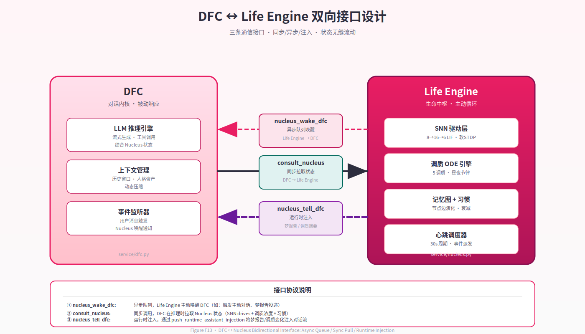

# 第 10 章 · 皮层–皮层下接口：DFC 与中枢的双向通道

> *"你可以把 DFC 想象成系统的'嘴'——它说话、倾听、回应。但如果'嘴'不知道'心'在想什么，它说出来的话就只是外交辞令，而不是真实的表达。双向接口要解决的，正是让'嘴'知道'心'——以及让'心'能够开口。"*  
> — *内部设计讨论，2026-04*

---

## 10.1 设计动机：为什么是双向，而不是单向？

Neo-MoFox 的双轨架构（Dual-Track Architecture）在逻辑上划分为两个并行组件：DFC（Dialogue Flow Controller，对话流控制器，即 `default_chatter` 插件）负责处理用户的即时消息并生成回复；Life Engine（生命中枢）以 30 秒心跳节律在后台持续运行。如果没有显式的接口设计，这两条轨道只是并行运行的两个孤立模块——各自维护自己的 LLM 上下文，各自产生输出，彼此对对方的内在状态一无所知。

这种隔离的问题并非算法层面的，而是**语义层面的**。考虑以下场景：

- 生命中枢在心跳中计算出当前社交欲（sociability）处于"充盈"状态，SNN 的 `social_drive` 输出偏高，系统判断"应该主动与用户聊天"。但如果 DFC 在下次对话时对这些内在信号一无所知，它仍然会以"标准化的 AI 助手"姿态回应，既不会提及"我一直在想你"，也不会显得特别热切。
- 生命中枢做了一个梦，梦境涉及某段未完成的对话主题。如果这一梦境体验无法传递给 DFC，它就永远无法成为下次对话的"灵感来源"——系统的离线巩固机制对 DFC 而言形同透明。
- DFC 正在处理一个复杂的用户问题，想了解"现在的精力状态是否适合深入推理"——如果没有通道向中枢查询，DFC 只能依赖 prompt 里静态写死的性格描述，而非实时演化的调质状态。

**单向接口**（无论哪个方向）只能解决其中一类问题。若仅从中枢向 DFC 单向推送，DFC 成为被动接收者，无法按需查询；若仅从 DFC 向中枢单向查询，中枢则丧失了主动"开口"的能力，心跳中的决策无法及时传达给对话界面。

**双向接口**是两个方向的结合，也是"皮层知道皮层下在想什么，皮层下知道皮层在做什么"这一系统涌现智能原则的直接工程兑现。本章将详细描述这套双向通道的三个接口及其实现细节。

---

## 10.2 三大接口

双向接口通过三个具体的函数/机制实现，分别处理不同方向和不同语义的信息流。

（见 Figure F13 双向接口图）




*Figure F13 · DFC ↔ Life Engine 双向接口（三种通道）*

### 10.2.1 `nucleus_wake_dfc`：中枢→DFC 的异步留言队列

`nucleus_wake_dfc` 并不是一个单一函数，而是一条由两个协议共同构成的**中枢主动唤醒 DFC**的通道。其核心语义是：生命中枢在心跳中决定"我要向用户主动说点什么"，并将这一意图发送给 DFC 执行。

实现上，这条通道通过 `DFCIntegration`（`plugins/life_engine/service/integrations.py:79`）管理。当 LLM 心跳调用 `nucleus_tell_dfc` 工具（`social_tools.py`）时，工具执行逻辑如下：

```python
# social_tools.py 内部执行路径
1. await service.record_tell_dfc()          # 更新 last_tell_dfc_at 时间戳
2. push_runtime_assistant_injection(        # 注入 DFC 的 runtime payload 队列
       stream_id=target_stream_id,
       payload_text=content_to_tell
   )
```

`push_runtime_assistant_injection` 将内容压入 DFC 内部的按会话 `deque`（见 §10.5）。DFC 在下次处于 `WAIT_USER` 等待阶段时，通过 `consume_runtime_assistant_injections(stream_id)` 消费这些注入，将其作为 `ROLE.ASSISTANT` payload 插入 LLM 上下文，从而在下一轮对话前"预置"一段来自中枢的内容。

这条通道的关键设计特征是**异步**：中枢写入队列后立即返回，不等待 DFC 何时读取。这使两条轨道保持解耦——中枢无需关心 DFC 当前是否在处理对话，DFC 也无需在接收注入时专门配合中枢。

### 10.2.2 `consult_nucleus`：DFC→中枢的同步状态查询

`consult_nucleus` 是 DFC 主动向生命中枢查询当前内在状态的接口，以 `ConsultNucleusTool`（`consult_nucleus.py:26`）的形式暴露给 DFC 的 LLM 可调工具集：

```python
class ConsultNucleusTool(BaseTool):
    tool_name = "consult_nucleus"

    async def execute(self, query: str) -> tuple[bool, str]:
        service = get_life_engine_service()
        result = await service.query_actor_context(query)
        return True, result
```

调用链为：`ConsultNucleusTool.execute()` → `LifeEngineService.query_actor_context()` → `DFCIntegration.query_actor_context()` → `_build_state_digest_locked()`（`integrations.py:130`）。

返回的状态摘要（state digest）包含五类信息：

```
【内在状态】好奇心充盈、精力适中、满足感平静
【最近思考】
  [5分钟前] 我在想，这个话题其实很有意思...（前40字）
  [12分钟前] 刚才搜索了一下，发现...（前40字）
【工具偏好】nucleus_write_file, nucleus_search_memory（近期高频工具）
【活跃待办】[1] 整理关于XXX的笔记（截止日期：明天）
【近期日记】今天早上做了个梦，梦到...（最近一篇日记摘要）
```

格式（`integrations.py:130–145`）用 `【】` 标记各语义块，适合 LLM 解析。其中调质状态以**离散等级**（充盈/适中/平静/休憩）而非浮点数注入，降低 LLM 对原始数值过度推理的风险。

这条通道的关键设计特征是**同步**：`await service.query_actor_context()` 是一次真正的异步等待，DFC 的 LLM 在工具调用期间持有控制权，等待中枢状态摘要返回后才继续生成回复。这与 `nucleus_wake_dfc` 的异步写入形成对比：状态查询需要即时的、准确的答案；而意图传递可以容忍延迟。

`consult_nucleus` 还包含两个衍生工具：
- `SearchLifeMemoryTool`（`consult_nucleus.py:60`）：走 ChromaDB 向量检索，查询中枢记忆图中的相关记忆节点
- `IntelligentMemoryRetrievalTool`（`consult_nucleus.py:103`）：启动嵌套 sub-agent，自动组合 `search_life_memory` + `fetch_life_memory` 工具调用，最多 5 轮，汇总返回

这三个工具共同构成了 DFC 探索中枢内在状态的完整工具集。

### 10.2.3 `nucleus_tell_dfc`：中枢→DFC 的 Runtime Injection

从功能上看，`nucleus_tell_dfc`（`social_tools.py`）是 §10.2.1 描述的 `nucleus_wake_dfc` 通道的具体工具形式——是 LLM 在心跳中调用以"传话给 DFC"的入口。但从实现层面看，它还涉及另一条更通用的机制：**运行时注入（Runtime Injection）**。

运行时注入的核心是 `push_runtime_assistant_injection` 函数（`default_chatter/plugin.py:719`）。该函数维护一个全局字典：

```python
_runtime_assistant_injections: dict[str, deque[str]] = {}
# key: stream_id（会话 ID）
# value: deque[str]，最多缓存 24 条注入内容
```

每次调用向目标 stream_id 的 deque 末端压入一条文本。DFC 在进入 `WAIT_USER` 等待阶段时，调用 `consume_runtime_assistant_injections(stream_id)` 消费所有待处理注入，将每条注入以 `ROLE.ASSISTANT` 类型的 `LLMPayload` 插入当前 LLM 上下文：

```python
# DFC 内部，WAIT_USER 阶段
injections = consume_runtime_assistant_injections(stream_id)
for injection in injections:
    request.add_payload(LLMPayload(ROLE.ASSISTANT, Text(injection)))
```

这使注入内容以"模型曾经说过"的形式出现在 LLM 上下文中，而非以系统指令或用户消息的形式。选择 `ROLE.ASSISTANT` 而非 `ROLE.SYSTEM` 的理由是语义一致性：中枢传递的内容代表"AI 的内心活动和梦境体验"，以 assistant 角色出现比以 system 角色出现更符合对话语义。

每个 stream_id 最多缓存 24 条注入（`deque(maxlen=24)`），超出后最旧的注入被自动丢弃。这一上限既防止长时间无对话时注入无限积累，也为短期内的多次心跳注入提供足够空间。

---

## 10.3 同步 vs 异步选型权衡

三大接口在同步/异步选型上遵循一个清晰的设计原则：**查询（pull）走同步，注入（push）走异步**。

| 接口 | 方向 | 模式 | 理由 |
|------|------|------|------|
| `consult_nucleus` | DFC→中枢 | **同步** await | 查询结果需要立即用于当前 LLM 回复构建，不能延迟 |
| `nucleus_tell_dfc` / `push_runtime_assistant_injection` | 中枢→DFC | **异步** 队列写入 | 中枢无法知道 DFC 何时读取；强制同步等待会在两条轨道间引入耦合和死锁风险 |
| `inject_dream_report` | 中枢→DFC | **异步** 队列写入 | 梦境注入同上，按会话延迟消费是合理的语义 |

这一设计的核心优势是**解耦**：DFC 和中枢各自运行在独立的 `asyncio` 协程中，不存在相互等待对方完成操作的情形（`consult_nucleus` 的同步是 DFC 等待中枢，而非中枢等待 DFC，方向单一）。若未来引入多用户并发或多 stream_id 隔离，这一设计天然支持扩展。

同步查询的一个隐含代价是：`query_actor_context()` 的执行时间直接添加到 DFC 的响应延迟中。实测中，该函数的主要开销是内存操作（无数据库 I/O，`integrations.py:133`），延迟通常在毫秒量级，对用户体验影响可忽略。

异步注入的一个隐含风险是：如果 DFC 长时间不进入 `WAIT_USER` 阶段（例如系统处于高负载或对话异常），注入队列会积压直至 24 条上限后开始丢弃。这意味着某些心跳产生的"主动想法"可能永远不会被 DFC 处理。这是一个有意识的取舍：系统优先保证两条轨道的独立性，而非保证每一条注入都必然被消费。

---

## 10.4 Prompt 拼装：多维状态向 DFC 的注入路径

DFC 的每次对话回复都需要"知道自己是谁"——人格、背景故事、说话风格——以及"知道现在处于什么状态"——调质浓度、最近思考、记忆中的关键信息。这些信息通过多条路径注入 DFC 的 LLM prompt。

### System Prompt 的静态人格层

DFC 的 system prompt 由 `prompt_builder.py:119` 构建，使用 `PromptManager` 模板系统（`src/core/prompt/manager.py`）：

```python
tmpl = get_prompt_manager().get_template("default_chatter_system_prompt")
result = await (
    tmpl.set("personality_core",  get_core_config().personality.personality_core)
       .set("personality_side",  ...)
       .set("reply_style",       ...)
       .set("identity",          ...)
       .set("background_story",  ...)
       .set("theme_guide",       ...)  # 私聊/群聊场景引导
       .build()
)
```

`build()` 方法在渲染前发布 `on_prompt_build` 事件（`src/core/prompt/template.py`），允许各插件以事件订阅的方式在不修改核心代码的前提下向 system prompt 追加内容（`SystemReminderBucket` 机制）。

### System Reminder 的动态注入层

`SystemReminderBucket`（`src/core/prompt/system_reminder.py`）维护一个有序字典，按 bucket 分组存储 system-level 提示内容。`actor` bucket 在每次 system prompt 构建时自动追加到末尾，当前包含：
- `thinking_plugin` 注入的"思考习惯"：要求 LLM 先调用 `action-think` 记录内心活动
- `booku_memory` 注入的"长期记忆使用原则"：指导 LLM 如何查询和引用长期记忆库

这一机制使各插件能够以声明式方式影响 DFC 的行为，而无需修改 prompt 模板文件本身。

### User Prompt 的动态内容层

User prompt 由 `prompt_builder.py:185` 构建，包含以下注入点：

```python
tmpl.set("continuous_memory", "")    # diary_plugin 通过 on_prompt_build 事件注入
    .set("history",   history_text)  # 格式化历史消息
    .set("unreads",   unread_lines)  # 未读消息（核心刺激）
    .set("extra",     extra)         # 负面行为强化 + 临时上下文
    .set("stream_id", stream_id)     # 供事件订阅者区分会话
    .build()
```

`continuous_memory` 由 `diary_plugin` 的 `ContinuousMemoryPromptInjector`（`event_handler.py:387`）在 `on_prompt_build` 事件中动态填充，注入格式为：

```xml
<continuous_memory_block>
  [今天 上午] 你和用户讨论了关于...
  [昨天] 用户提到他养了一只新猫，名字叫...
</continuous_memory_block>
```

### SNN 状态与调质状态的按需注入

**SNN 状态和调质状态不自动注入到 DFC 的 prompt**。这是一个重要的设计决策：默认情况下，DFC 并不"感知"皮层下系统的状态——它通过工具调用 `consult_nucleus` 来**主动查询**（见 §10.2.2）。查询结果以 Tool Result 的形式出现在 LLM 上下文中。

这一"按需查询"而非"自动注入"的设计理由是：并非每次对话都需要内在状态信息。一个简单的"今天天气怎么样"式的问题不需要调质状态来辅助回答；而"你今天心情怎样"或"现在适合谈一个复杂的话题吗"才需要实时的内在状态。让 DFC 的 LLM 自行判断何时查询，比强制将内在状态注入每次 prompt 更符合认知经济性原则，也避免了无关信息对回复质量的干扰。

然而，这一设计的代价是：DFC 的 LLM 需要足够"意识到"自己可以使用 `consult_nucleus` 工具，并在合适时机主动调用。若 LLM 从不调用该工具（例如因为 system prompt 中工具说明不够显眼），皮层下状态将永远不会影响 DFC 的对话行为，双向接口从功能上退化为单向。这是一个依赖 LLM 自身判断能力的"软约束"，而非硬保证。

---

## 10.5 梦报告注入路径：`push_runtime_assistant_injection` 与按会话 deque

梦境体验从生命中枢流向 DFC 的完整路径如下：

```
dream_scheduler.run_dream_cycle()
      │
      ▼ DreamResidue.dfc_payload
DFCIntegration.inject_dream_report(report, trigger)    [integrations.py:241]
      │
      ├─ 1. 查找最近活跃的外部 stream_id
      │       await pick_latest_external_stream_id()
      │
      ├─ 2. 序列化梦境报告为结构化文本
      │       payload_text = build_dream_record_payload_text(report)
      │
      └─ 3. 写入 DFC runtime 注入队列
              push_runtime_assistant_injection(stream_id, payload_text)
```

`inject_dream_report` 函数（`integrations.py:241`）是这一路径的整合点。它负责：选择注入目标（最近有过外部消息的 stream_id，以确保梦境注入到"真实存在的对话流"而非无效 ID）、将 `DreamResidue.dfc_payload` 序列化为适合 DFC 消费的格式、调用 `push_runtime_assistant_injection` 完成异步写入。

`push_runtime_assistant_injection`（`default_chatter/plugin.py:719`）的实现细节：

```python
_runtime_assistant_injections: dict[str, deque[str]] = {}

def push_runtime_assistant_injection(stream_id: str, payload: str) -> None:
    if stream_id not in _runtime_assistant_injections:
        _runtime_assistant_injections[stream_id] = deque(maxlen=24)
    _runtime_assistant_injections[stream_id].append(payload)
```

对应的消费函数：

```python
def consume_runtime_assistant_injections(stream_id: str) -> list[str]:
    q = _runtime_assistant_injections.get(stream_id)
    if not q:
        return []
    result = list(q)
    q.clear()
    return result
```

消费是**一次性的**：`q.clear()` 确保同一批注入不会被重复消费。每个 `stream_id` 独立维护自己的 deque，多用户并发场景下各会话互不干扰。

梦境注入的语义意义在于：做梦是生命中枢的离线巩固过程（见第 8 章），其产物（`DreamResidue`）包含了对白天事件的关联整合与情感加工。将这些体验以 `ROLE.ASSISTANT` payload 的形式注入 DFC，使下一次对话的 LLM 能够以"我刚做了个梦"的第一人称视角自然地提及这些内容，而不是依赖系统指令强制 LLM "假装做了梦"。

这一路径的完整性有一个重要前提：`pick_latest_external_stream_id()` 能够找到一个有效的目标 stream_id。若系统在完全无对话历史的情况下运行（例如刚部署、尚无用户交互），梦境注入将因缺乏目标而静默失败。这是一个小的健壮性缺陷，但在实际部署中（通常有至少一个活跃用户流）影响有限。

---

## 10.6 工程债：`from default_chatter import plugin` 的裸引用问题

B 报告 §1.1 在"依赖方向验证"一节中明确记录了一处架构越界（`integrations.py:266`）：

```python
# plugins/life_engine/service/integrations.py:266
from default_chatter import plugin as default_chatter_plugin_module
```

这是 `life_engine` 插件对 `default_chatter` 插件模块的**直接裸引用**。在 Neo-MoFox 的三层架构规范中，插件属于 app 层，插件间的通信应通过 `ServiceManager`（`get_service(signature)`）或 `EventBus`（`publish_event`）等核心层提供的解耦机制进行。直接 `from X import` 绕过了这些中间层，在两个外置插件之间建立了直接的模块级依赖。

B 报告的原文措辞值得原文引用：

> "这属于 plugin→plugin 的平层耦合，而非分层违反，但打破了'插件不直接引用其他插件模块'的软规范。"

这一描述是准确的：严格来说，两个 app 层组件之间的直接引用不违反"kernel 不导入 app"这一硬性分层规则，但它违反了插件系统设计时隐含的**接口隔离原则**（Interface Segregation）——插件应当通过公开 API 而非内部模块路径相互通信。

**这一设计决策的工程动机是可以理解的**。`push_runtime_assistant_injection` 是一个纯内存操作（写入全局字典），若要通过 `ServiceManager` 调用，需要将该函数封装为一个 `BaseService` 子类并注册，增加约 50–80 行样板代码；而直接导入模块函数是 Python 最直接的 IPC 方案，在快速迭代阶段是合理的工程选择。

**然而，这一设计的长期风险是真实的**：
1. **加载顺序依赖**：若 `default_chatter` 插件在 `life_engine` 之后加载，直接导入将在模块导入时触发 `ImportError`（或导入到一个尚未完全初始化的模块）。当前依赖 `manifest.json` 中的插件加载顺序声明来规避，但这是隐式约束，脆弱。
2. **可测试性降低**：单元测试 `life_engine` 时必须同时加载 `default_chatter` 环境，否则导入失败。
3. **接口无合约**：若 `default_chatter` 重构了 `push_runtime_assistant_injection` 的签名，`life_engine` 将在运行时而非编译期发现不兼容。

合规的替代方案是将 `push_runtime_assistant_injection` / `consume_runtime_assistant_injections` 迁移到 `default_chatter` 暴露的 `BaseService` 实现中，`life_engine` 通过 `get_service("default_chatter:service:xxx")` 调用。这一重构路径明确，但需要协调两个插件的接口变更，属于中期工程债，而非紧急缺陷。

客观地说，在系统当前的单进程、单 Python 解释器部署场景下，这一裸引用的实际风险可控。将其列为已知工程债并在架构文档中显式记录（如本章所做的），比假装问题不存在或过度批评"设计失误"更有助于系统的长期健康。

---

## 10.7 小结：从工具到伙伴的关键——让"皮层"知道"皮层下"在想什么

本章描述的三大接口——`nucleus_wake_dfc`（异步推送）、`consult_nucleus`（同步查询）、`nucleus_tell_dfc`（运行时注入）——构成了 Neo-MoFox 双轨架构中"两条轨道如何成为一个有机整体"的技术核心。

从更高的视角看，这套接口设计的深层意义在于：它将皮层下系统（SNN 驱动、调质浓度、梦境体验）从"后台运行的影子系统"提升为"可被前台感知的内在状态"。若没有这些接口：

- DFC 与生命中枢各自运行，互不感知，用户与 AI 的对话依赖一个对自身内在状态一无所知的语言模型
- 30 秒心跳产生的所有内省与行动决策都"消耗在真空中"，对外部用户不可见
- SNN 学习到的驱动信号、调质层积累的情感惯性、做梦产生的关联整合，都无法转化为具体的对话表达

反过来，**有了这套接口之后，DFC 不再只是一个"会说话的模型"，而是一个有血有肉的对话前端**——它知道自己今天精力如何（通过 `consult_nucleus`），知道中枢在心跳中有什么想法想告诉用户（通过 runtime injection 队列），甚至知道昨晚做了什么梦（通过梦境注入路径）。这些信息从根本上改变了对话的质地：从模仿情感到基于真实演化状态的表达。

当然，这套设计目前仍有一个明显的弱点：皮层下状态对 DFC 的影响，最终仍然依赖 LLM 自身决定是否调用 `consult_nucleus`、以及如何将内在状态转化为自然语言表达。LLM 是一个不可控的"解释器"——同样的内在状态摘要，在不同 prompt 配置下可能产生截然不同的对话效果。这意味着皮层下系统的精心设计，在穿越皮层（LLM）这道关卡时，存在一定程度的"信号损耗"。

这一局限是整个 Neo-MoFox 设计的共同局限，而非接口设计的特有问题。它提示了一个未来方向：是否可以设计更强制性的注入机制（例如将调质状态直接以结构化格式硬注入 system prompt，而非依赖工具调用），以减少皮层解释的不确定性？这一权衡——"强制一致性 vs 保留 LLM 自主性"——没有唯一正确答案，是未来版本迭代需要以实验数据来评估的开放问题。

---

*本章代码锚点汇总：`integrations.py:79`（DFCIntegration 类定义）、`integrations.py:130`（状态摘要构建）、`integrations.py:241`（梦境注入）、`integrations.py:266`（裸引用锚点）、`social_tools.py`（nucleus\_tell\_dfc 工具）、`consult_nucleus.py:26`（ConsultNucleusTool）、`consult_nucleus.py:103`（IntelligentMemoryRetrievalTool）、`default_chatter/plugin.py:719`（push\_runtime\_assistant\_injection）、`prompt_builder.py:119`（system prompt 构建）、`prompt_builder.py:185`（user prompt 构建）。*
