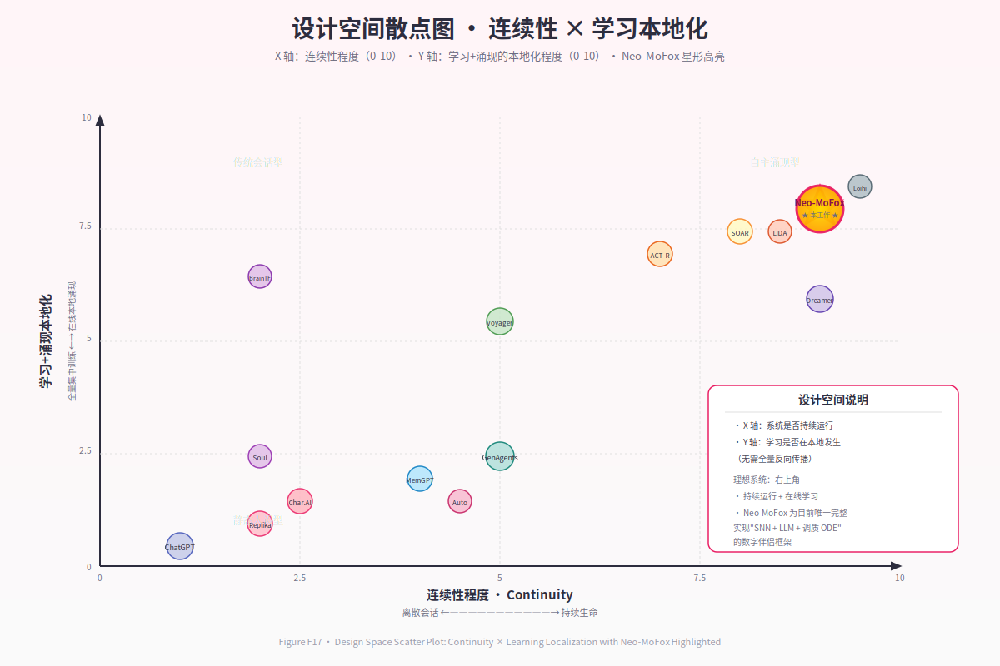

# 第 12 章 · 与既有工作的系统级比较

> *"我们不是在某一个维度上比别人更好，而是在维度的组合上选择了一条没人走过的路。"*

---

## 12.1 比较框架

直接逐项与同行 PK 容易陷入"哪一项做得更精"的细节争吵，对一个**系统论文**而言，更恰当的视角是：在哪一个**设计空间**中，每个工作选择了哪个角落？我们因此先建立比较框架，再逐邻域展开。

我们用三个正交维度刻画"数字生命"类系统的设计空间：

- **D1 · 连续性维度（Continuity Axis）**：系统在两次外部输入之间是否仍有内在状态在演化？取值范围由"无"到"完全连续"。
- **D2 · 学习方式维度（Learning Axis）**：系统的可塑性如何驱动？从"无在线学习"到"全在线本地学习"。
- **D3 · 智能来源维度（Intelligence-Origin Axis）**：智能主要由"单一模型权重"承担，还是由"异质子系统协作"承担？

三维定位见 Figure F17 设计空间散点。Neo-MoFox 在三个维度上都靠近"右上角"，这正是其差异化的根源——但也意味着在每个维度上单独看，并非冠军（详见 §12.6）。

*Figure F17 · 设计空间散点图*
## 12.2 与商业数字伴侣的差异（D1 主导）

- **Replika**：典型的"会话触发"模型。在两次会话之间，Replika 的"内在状态"由用户档案与少量长期事实组成，这些信息是**离散静态字段**，不会因为时间推移而演化。系统不满足连续性 C2（无演化）也不满足 C3（时间推移与状态距离弱相关）。Neo-MoFox 在 C1–C4 上全部满足（详见第 9 章）。
- **Character.AI / Pi**：人格系全静态文本设定 + LLM 推理。"性格漂移"在产品层面被**抑制**（避免长期对话中人格走样），与 Neo-MoFox 把"性格漂移"作为**正面特征**形成相反取向。
- **Project December**：以"已逝亲人模拟"为卖点，但状态全部静态化于 prompt。哲学定位刻意避开"持续生命"，与 Neo-MoFox 的核心命题正好对立。

**关键差异（一句话）**：商业数字伴侣把"角色一致性"放在首位，把连续性当作可选风味；Neo-MoFox 反之——连续性是地基，一致性是连续性涌现的副产物。

## 12.3 与经典认知架构的差异（D2/D3 双线）

- **SOAR (Laird et al., 2012)**：长生命周期、生产规则系统、Chunking 实现技能学习。Neo-MoFox 致敬 SOAR 把"持续运行"作为基本面，但 SOAR 没有皮层（无 LLM 整合），也没有皮层下的神经动力学（无 SNN/调质）。Neo-MoFox 把这两端补齐。
- **ACT-R (Anderson, 2004)**：模块化记忆 + 激活公式 + 产生式编译。其"激活值衰减"与我们的 Ebbinghaus 衰减同源；其"chunk"约略对应我们的 MemoryNode。差异在于：ACT-R 是**符号 + 半数值**架构，没有连续 ODE 形态的情绪层，也没有皮层级的语言整合。
- **LIDA (Franklin & Ramamurthy, 2008)**：基于全局工作空间理论的认知架构，含多机制学习与意识流。Neo-MoFox 与 LIDA 在"多子系统协作 + 持续运行"上同属一脉，但 LIDA 没有用 SNN 作为皮层下、也没有把 LLM 作为皮层。
- **Common Model of Cognition (Laird, Lebiere & Rosenbloom, 2017)**：统一了 SOAR/ACT-R/Sigma 的共识结构，是"现代认知架构标准模型"。Neo-MoFox 可被视为在 CMC 上**追加皮层（LLM）和皮层下（SNN+调质）**两个生物学保真层的扩展（见 Figure F2 同行光谱图）。

**关键差异**：经典认知架构面向"如何让机器解决问题"（problem-solving）；Neo-MoFox 面向"如何让机器持续存在"（continued existence）。问题解决可以被生命存在所包含，反之不真。

## 12.4 与 LLM Agent 的差异（D3 主导）

- **AutoGPT / BabyAGI**：以 LLM 调用为主循环，靠 prompt 注入实现"自主"。其"主动性"来自外部任务列表的循环，而不是内在驱动；停机与运行的差异仅由"任务是否完成"决定。
- **Voyager (Wang et al., 2023)**：在 Minecraft 中以技能库 + 课程学习的方式让 LLM Agent 进步。其学习是**代码生成层**的（写新技能并存入库），而非神经层的；且其内驱由探索奖励决定，无情绪/调质对应物。
- **Generative Agents (Park et al., 2023)**：里程碑式工作，引入 reflection 机制把对话沉淀为长记忆。我们与 GA 共享"反思 → 巩固"的思想，但：
  - GA 的"时间"是**模拟时钟**（推进帧），而 Neo-MoFox 的时间是**真实墙上时间**；
  - GA 的反思是**LLM 调用产物**（即"皮层做反思"），Neo-MoFox 的"做梦"由皮层下激活扩散驱动种子，再由 LLM 仅做叙事化（皮层下做反思的种子选择）；
  - GA 没有调质 ODE，没有 SNN 在线学习。
- **ChatDev / 多 Agent 系统**：把 LLM 角色化分工解决软件工程任务。与 Neo-MoFox 的关注点正交。

**关键差异**：LLM Agent 把 LLM 调用当主循环；Neo-MoFox 把 LLM 调用当**异步资源**（详见 §4.5 频率分层）。这一差异看似工程细节，实则决定了"系统是否能在 LLM 沉默时仍然活着"。

## 12.5 与持久记忆系统的差异（D2 子集）

- **MemGPT / Letta (Packer et al., 2023)**：把 LLM 上下文窗口建模为"主存 + 外存"，通过工具调用读写外存。其本质是**操作系统视角**的记忆，重点在"什么时候 swap-in"。
- **Mem0 / Zep**：向量化的对话记忆，提供检索接口。其本质是**搜索引擎视角**的记忆。
- **A-MEM (2024)**：引入语义图 + 自适应索引。最接近 Neo-MoFox 的记忆图思想。

Neo-MoFox 记忆系统与上述工作的关键差异在三点：
1. **图节点本身有"生命周期"**：节点强度按 Ebbinghaus 衰减，使用即强化（Hebbian），不只是被检索的对象。
2. **激活扩散驱动联想**：检索不是单跳，而是图遍历——这让"想到 A 自然想到 B"成为可能（第 7 章 §7.7）。
3. **与做梦机制耦合**：REM 阶段在记忆图上随机游走生成种子（第 8 章 §8.5），把"被检索的图"升级为"自己也会做梦的图"。

**关键差异**：MemGPT/Mem0 把记忆当**仓库**；Neo-MoFox 把记忆当**生命体的一部分**——它会衰减、会强化、会做梦、会驱动新行为。

## 12.6 完整比较矩阵（Figure F16）

下表汇总了 14 个最相关的工作，按 7 个核心维度对比。完整版本见 Figure F16；此处给出**精简骨架**：

*Figure F16 · 14 系统 × 7 维度对比矩阵*
| 维度 / 系统 | 24×7 连续 | 皮层下 SNN | 在线学习（无 BP） | 离线巩固/做梦 | 调质 ODE | 多模态事件 | 开源 |
|----------|:----:|:----:|:----:|:----:|:----:|:----:|:----:|
| Replika | ✗ | ✗ | ✗ | ✗ | ✗ | 部分 | ✗ |
| Character.AI | ✗ | ✗ | ✗ | ✗ | ✗ | ✗ | ✗ |
| SOAR | ✓ | ✗ | Chunking | ✗ | ✗ | 有限 | ✓ |
| ACT-R | 部分 | ✗ | 产生式编译 | ✗ | ✗ | 有限 | ✓ |
| LIDA | ✓ | ✗ | 多机制 | ✗ | ✗ | 有限 | ✓ |
| Generative Agents | 模拟时钟 | ✗ | ✗ | 反思 | ✗ | ✗ | ✓ |
| MemGPT/Letta | 任务触发 | ✗ | ✗ | ✗ | ✗ | ✗ | ✓ |
| AutoGPT | 任务执行 | ✗ | ✗ | ✗ | ✗ | 有限 | ✓ |
| Voyager | 任务导向 | ✗ | 代码生成 | ✗ | ✗ | ✗ | ✓ |
| DreamerV3 | 训练循环 | ✗ | 世界模型 | 想象轨迹 | ✗ | ✗ | ✓ |
| BrainTransformers | 推理调用 | SNN-Trans | STDP 初始化 | ✗ | ✗ | ✗ | ✓ |
| Intel Loihi 2 | 硬件平台 | ✓（硬件） | 片上 STDP | ✗ | ✗ | 有限 | 研究 |
| Doya 调质模型 | N/A | ✗ | N/A | N/A | ✓（四调质） | N/A | 文献 |
| **Neo-MoFox** | **✓** | **✓（软件）** | **STDP/Hebbian** | **✓（NREM/REM）** | **✓（五调质）** | **事件流** | **✓** |

需要诚实指出：在**任何单一维度**上，Neo-MoFox 都不是冠军。
- 论 SNN 规模与片上效率，远不及 Loihi 2；
- 论世界模型质量，远不及 DreamerV3；
- 论商业打磨度，远不及 Replika；
- 论 LLM Agent 任务完成度，远不及 Voyager。

Neo-MoFox 的**贡献不是任一维度的极致**，而是**在维度组合上选择了此前未被同时占据的位置**——并以此组合验证三大原则的工程可行性。

## 12.7 设计空间定位（Figure F17）

把 D1×D2×D3 三维投影到二维（D1 横轴：连续性程度；D2+D3 纵轴：学习+涌现的本地化程度），可以画出散点图（见 Figure F17 设计空间散点）。粗略分布如下：

- **左下角**（无连续 + 模型驱动）：Replika、Character.AI、Pi。
- **左上角**（无连续 + 系统协作）：经典符号 AI、SOAR/ACT-R 早期。
- **右下角**（连续 + 模型驱动）：DreamerV3、Voyager。
- **右上角**（连续 + 系统协作）：LIDA、Generative Agents、**Neo-MoFox**。

Neo-MoFox 在右上角内进一步靠近**"皮层下生物学保真"**这一极端：它并不只是把多个子系统接起来，而是让每个子系统都遵循"局部可塑 + 时间常数 + 基线回归"的神经科学结构。这是 LIDA/GA 也没有完全到达的位置。

## 12.8 与同行的可重用性

为了避免比较成为零和叙事，我们想强调 Neo-MoFox 与同行存在大量**正交可组合**的关系：

- 我们的 SNN 模块可以替换为 Loihi 硬件实现，性能与神经形态深度都将提升。
- 我们的记忆图可以借用 A-MEM 的自适应索引算法。
- 我们的"做梦"叙事生成可以借用 Generative Agents 的 reflection prompt 工程。
- 我们的 LLM 整合可以借用 MemGPT 的"主存–外存"调度策略。

我们因此把本工作定位为**集成性（integrative）贡献**：在更大的研究图景中，Neo-MoFox 是一个尝试把已有思想以神经科学语境**重新组装**的开源参考实现。

## 12.9 小结

本章给出了三维设计空间，把 14 个相关工作定位其中，澄清了 Neo-MoFox 不是任一维度的冠军，而是维度组合的开拓者。我们也诚实地指出了与同行可正交组合的方向。下一章将进一步打开诚实之门，把项目自身的工程局限、科学局限与伦理担忧集中陈述。
